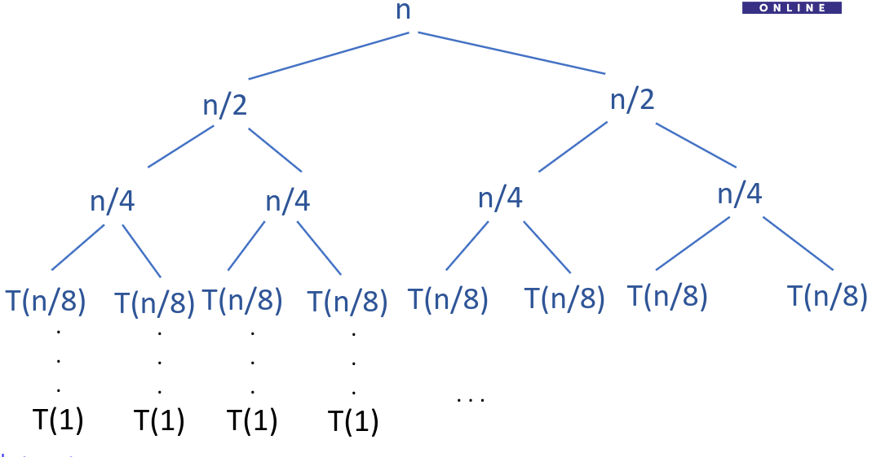

# Recurrence Tree

We can represent the recurrence relation as a tree
Eg T(n) = 2T(N/2)+n can be represented as

Using this tree we can find out
- Cost for resolving solution at every level
- Height of the tree
- Cost for resolving last level
- Cost for resolving all levels
**And the solution will be -
$\qquad$ Time taken to resolve all levels + time taken to resolve last level**

*Note: if the tree grows unevenly, make all calculations assuming that the tree is balanced with depth to deepest leaf*

[[amortized-analysis|Amortized Analysis]]
