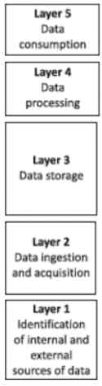

### **Four Vs of Big Data:**
1. **Volume**: Encompasses a massive increase in data, requiring automated processing.
2. **Variety**: Involves diverse data formats, including static and streaming data, to extract knowledge.
3. **Velocity**: Data is generated rapidly, necessitating real-time input and response.
4. **Veracity**: Focuses on data trustworthiness and accuracy, addressing challenges like hashtags and typos.

### **Data Formats**
1. Structured
2. Unstructured (docs,tweets,videos)
3. Semi-Structured(xml)

### **Data Architecture Design**

