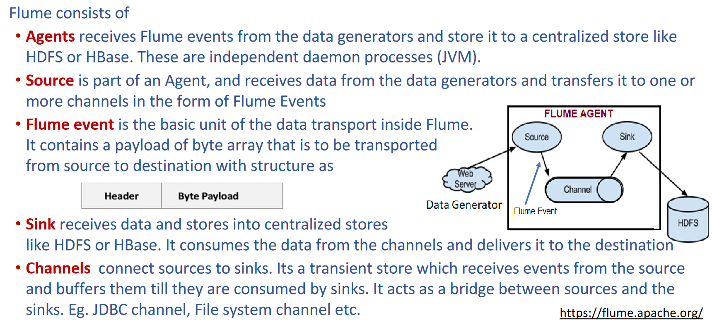

## Hadoop Ecosystem
• Pig-scripting tool
• HIVE-SQL like query tool
• SQOOP-RDBMS tool
• Flume-Tool to capture weblog data
• OOZIE-Workflow Manager
• HBASE-Distributed Columnar database


### Oozie

Recommendation system needs to precompute, online too expensive

`Apache Oozie is a workflow scheduler system to manage Apache Hadoop jobs. It allows users to define, manage, schedule, and execute complex Hadoop workloads via web services. Oozie is tightly integrated with the Hadoop stack, supporting various Hadoop jobs like Hive, Pig, Sqoop, as well as system-specific jobs like Java and Shell.`

#### What is an workflow
• The sequence of steps is called a Workflow
• Workflows are common in data centers
• Users would like to
	• Specify the steps
	• Specify when the steps are to be run
	• Maybe periodically
• Run the Workflow
• What to do in case of error

Apache Oozie **schedules**, **runs** and **manages** different types of jobs in a Hadoop distributed environment.

`dependencies between the jobs`->`specified by the user` ->`Directed Acyclic Graphs`->`consumes this information and schedules these in the correct order as specified in the workflow along with a specified frequency`

It is an open Source Java Tomcat Web-Application
- It **receives requests from a client**, **triggers workflow actions** by using **Hadoop execution engine** to actually execute the task. It provides a **unique callback HTTP URL** to the task which then **notifies that URL** when it is complete.
- Oozie can also detect completion of tasks by **polling** the task for completion and then returns the result to the client.
- Oozie leverages the **existing Hadoop machinery** for **load balancing**, **fail-over**, etc


#### Oozie workflow

- Oozie workflow consists of **Action nodes** and **Control flow nodes**.
- An **action node** represents a workflow task, e.g., moving files into HDFS, running a MapReduce, Pig or Hive jobs, importing data using Sqoop or running a shell script of a program written in Java.
- A **control-flow node** controls the workflow execution between actions by allowing constructs like conditional logic wherein different branches may be followed depending on the result of earlier action node.

##### Control Node
- Start Node, designates the start of the workflow job.
- End Node, signals end of the job.
- Error Node designates the occurrence of an error and corresponding error message to be printed.
- Fork(Start parallel tasks)
- Join(Merge parallel tasks)
- Decision(switch case)

##### Action Node
When action node finishes, next task in workflow will start


At the end of execution of a workflow ,HTTP callback to update client with workflow status
Action node can trigger callback too


### Pig

`Apache Pig is a high-level platform for creating MapReduce programs. It provides a scripting language called Pig Latin that is used to write Pig programs. Pig Latin is a high-level abstraction of MapReduce, which makes it easier to write and maintain MapReduce programs.`

| Pig                                                                          | Hadoop                                                  |
| ---------------------------------------------------------------------------- | ------------------------------------------------------- |
| High level data flow tool                                                    | Low level data processing paradigm                      |
| Built in support for data operations like joins,filters,ordering,sorting etc | Performing data operations in mapreduce is tedious task |
|          Provides nested data types like tuples,bags and maps                                Nested data types are not there                                    |                                                         |
| No need to write complex programs                                            | You need to write programs in Java/Python               |

But as mapreduce is lower level ,it has a greater efficiency

#### What is PIG

- High level scripting language by yahoo as open source high level data flow system
- 10 lines of pig latin -> 200 lines of map reduce java
- 2 main components
	- pig latin
	- pig execution


pl scripts converted to map reduce internally


```
visits = load /ipldata/visits as (user,matchid, time);
gMatches = group visits by matchId;
matchPopularity = foreach gMatches generate matchId, count(visits);
matchInfo = load /ipldata/matchInfo as (url, venue, winner);
venueCounts = join gMatches by matchId, matchInfo by matchId;
gVenues = group venueCounts by venue;
topMatches = foreach gVenues generate top(matchPopularity,10);
store topMatches into /data/topMatches;
```

#### SQOOP

**SQL -to -Hadoop (Apache)**

- Supports bulk import and export of data into and out of HDFS
- From structured DBS like RDBMS, NOSQL,DATA WAREHOUSES etc (defines schema for import)
- Data migration tool based on connector architecture
- Advantage of migrating to HDFS : streaming data access so we can handle data as it comes, and then batch export to DB
- Integrates with Oozie as an action
-  Supports plugins for  data sources(new external systems)


##### Import


##### Export


#### Flume

`Apache Flume is a distributed, reliable, and scalable streaming data collection, aggregation, and transportation system. It is designed to efficiently collect large amounts of streaming data from a variety of sources, such as logs, social media feeds, and sensors. Flume can then aggregate and transport the data to a variety of destinations, such as HDFS, HBase, and Kafka.
`
Getting these data into HDFS with Hadoop commands like “put” would need the data to be
packaged and available as files, and transfer one file at a time. In scenarios like webservers where data is continuously generated could lead to challenges of delay, reliability

##### What is Flume

**ingestion mechanism** for effectively **collecting,aggregating** and **moving** **large amounts of data**

Its based on streaming data flows for **collecting large amounts of streaming data** to a **centralized store** from sources such as **Events** and **logs**




#### Ambari

`Open source web-based management framework / tool for Hadoop clusters`


1) Ambari Stacks
	- collection of Hadoop services and components that have been tested and certified to work together. Stacks include Hadoop services such as HDFS, YARN, Hive, and Spark.
2)  Ambari Blueprints
	- Ambari Blueprints are a way to automate the provisioning and configuration of Hadoop clusters using Ambari. They are essentially templates or specifications that describe how a cluster should be set up. Blueprints include information about the services, components, host assignments, and configurations needed for a cluster.
	- Cluster definition files ( 2 JSON files) , one generic template and one that sets specific properties to launch the deployment process
	
In summary, Ambari Stacks define the abstract structure and configuration options for Hadoop services and components, while Ambari Blueprints use this stack information to automate the actual deployment and configuration of Hadoop clusters


#### Hive

`Hive is the open source data warehouse infrastructure developed by Facebook system to process structured data in Hadoop`

Hive is **similar to SQL** and thus provides an easier and simpler way for **querying**, **analysing**,
**summarizing** and **managing** **structured data** in HDFS, while being built on top of Map/Reduce and Hadoop

It supports various languages on client side.

key components:  
1. **Data Storage**: Hive works with data stored in Hadoop Distributed File System (HDFS) or other storage systems compatible with Hadoop, such as Apache Parquet, Apache ORC, or plain text files.  
2. **Metastore**: Hive uses a metastore to store metadata about tables, schemas, columns, and data types. This metadata helps Hive translate SQL-like queries into low-level MapReduce or Tez jobs that can process the data efficiently. The metastore can be backed by a traditional relational database system like MySQL, PostgreSQL, or an embedded Derby database.  
3. **Hive Query Language (HQL)**: Hive provides a SQL-like language called Hive Query Language (HQL) that allows users to write queries and manipulate data stored in Hadoop. HQL abstracts the complexity of writing MapReduce or Tez jobs directly, making it easier for analysts and data scientists who are familiar with SQL to work with big data. Supports joins, aggregate etc and various data types(structs lists and maps)
4. **Hive CLI and Interfaces**: Users can interact with Hive in multiple ways, including:
	- **Hive CLI**: A command-line interface for running Hive queries.    
	- **HiveServer2**: A service that allows remote clients to connect to Hive and submit queries using Thrift, JDBC, or ODBC protocols.   
	- **Hive Web UIs**: Various web-based interfaces and tools that provide a graphical way to interact with Hive.  
5. **Execution Engine**: When a user submits a query, Hive translates the HQL into a series of MapReduce, Tez, or Spark jobs, depending on the execution engine chosen. Initially, Hive used MapReduce as its primary execution engine, but it has since added support for other engines like Tez and Spark, which can be faster and more efficient for certain types of queries.  
6. **Optimizations**: Hive includes several optimizations to improve query performance. These include query optimization, predicate pushdown, partition pruning, and more. These optimizations help Hive generate efficient query plans that can be executed on the Hadoop cluster.  
7. **Integration**: Hive can be integrated with other components of the Hadoop ecosystem, such as HBase, Spark, Pig, and others. This allows users to leverage different tools and frameworks for specific tasks within a big data pipeline.

 In summary, Hive is a data warehousing and querying tool for Hadoop that provides a SQL-like interface for working with large datasets. It translates high-level SQL-like queries into low-level MapReduce, Tez, or Spark jobs to process data efficiently in a distributed Hadoop environment. Hive is widely used in the big data ecosystem for tasks like data analysis, reporting, and data transformation.


 
