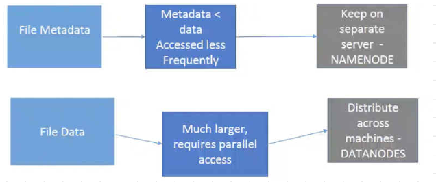
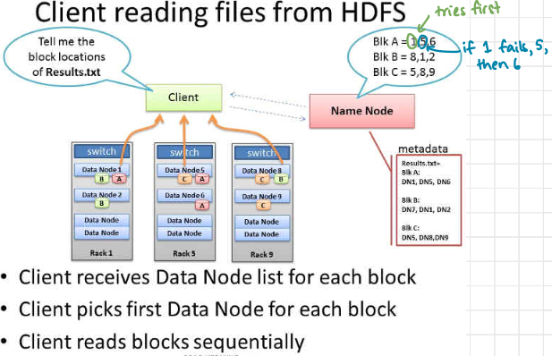

**Filesystems vs. Distributed Filesystems**

- _Filesystems_ manage files on a single machine and store the mapping of files to blocks locally.
- _Distributed Filesystems (DFS)_ manage files on multiple machines over LANs and WANs, distributing file data across multiple nodes.

**Factors Affecting Read Time in File Systems**

- _Seek Time_: The time it takes to position the read/write head on the correct track depends on the current track and the mechanical movement of the head. The scheduling algorithm determines the positioning to reduce rotational latency.
- _Rotational Latency_: This delay occurs while waiting for the desired sector to rotate under the head. On average, it's half the full rotational time.
- _Block Transfer Time_: This time depends on electronics and is typically fast and fixed.

### **HDFS (Hadoop Distributed File System)**

- **Inspired by GFS (Google File System):** HDFS draws inspiration from Google File System (GFS) and was introduced in 2003.
- **Open Source:** HDFS is an open-source distributed file system.
- **Origin:** It originated from the Apache Nutch search engine project.
- **Designed for Large Files and Streaming Data Access:**
    - HDFS is specifically designed for storing very large files, including those with sizes ranging from MB (megabytes) to TB (terabytes).
    - It runs on clusters of commodity hardware, making it cost-effective.
- **Read-Mostly Data Pattern:**
    - HDFS is optimized for scenarios where data is written once but read many times, making it highly efficient for analytics.
    - Emphasizes the importance of the time to read the whole dataset rather than the latency to read the first record.
    - Suited for analyses that involve processing large portions of the dataset.
- **Commodity Hardware:**
    - HDFS operates on inexpensive commodity hardware, including rack servers.
    - This cost-effective approach makes it accessible for a wide range of applications.

**Scaling out** better than **scaling up** 
But commodity servers are not reliable
redundancy data stored on 3 machines (so that if one fails, one can make a copy and another can serve)

