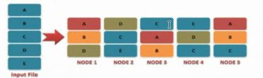
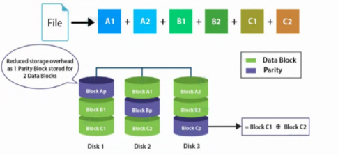
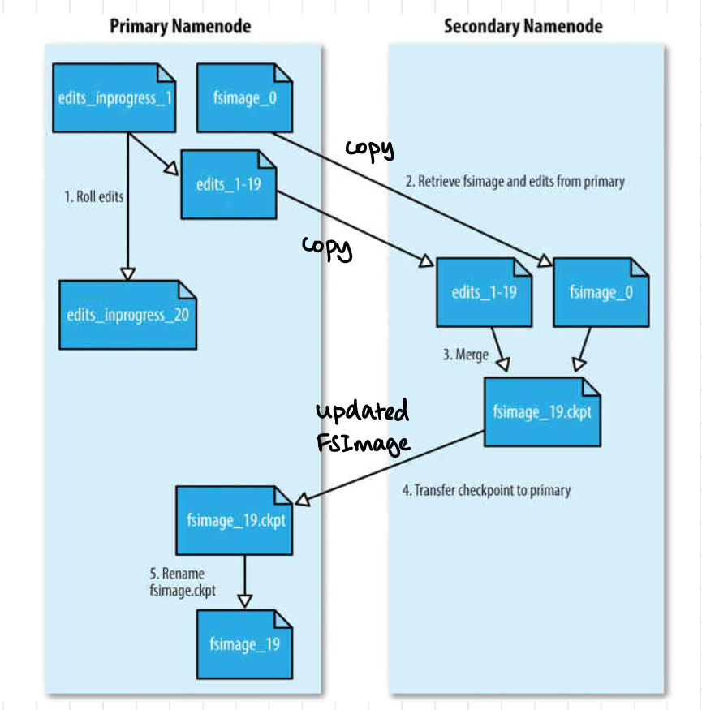

**Filesystems vs. Distributed Filesystems**

- _Filesystems_ manage files on a single machine and store the mapping of files to blocks locally.
- _Distributed Filesystems (DFS)_ manage files on multiple machines over LANs and WANs, distributing file data across multiple nodes.

**Factors Affecting Read Time in File Systems**

- _Seek Time_: The time it takes to position the read/write head on the correct track depends on the current track and the mechanical movement of the head. The scheduling algorithm determines the positioning to reduce rotational latency.
- _Rotational Latency_: This delay occurs while waiting for the desired sector to rotate under the head. On average, it's half the full rotational time.
- _Block Transfer Time_: This time depends on electronics and is typically fast and fixed.

### **HDFS (Hadoop Distributed File System)**

- **Inspired by GFS (Google File System):** HDFS draws inspiration from Google File System (GFS) and was introduced in 2003.
- **Open Source:** HDFS is an open-source distributed file system.
- **Origin:** It originated from the Apache Nutch search engine project.
- **Designed for Large Files and Streaming Data Access:**
    - HDFS is specifically designed for storing very large files, including those with sizes ranging from MB (megabytes) to TB (terabytes).
    - It runs on clusters of commodity hardware, making it cost-effective.
- **Read-Mostly Data Pattern:**
    - HDFS is optimized for scenarios where data is written once but read many times, making it highly efficient for analytics.
    - Emphasizes the importance of the time to read the whole dataset rather than the latency to read the first record.
    - Suited for analyses that involve processing large portions of the dataset.
- **Commodity Hardware:**
    - HDFS operates on inexpensive commodity hardware, including rack servers.
    - This cost-effective approach makes it accessible for a wide range of applications.

**Scaling out** better than **scaling up** 
But commodity servers are not reliable
redundancy data stored on 3 machines (so that if one fails, one can make a copy and another can serve)

#### HDFS Fault Tolerace
##### Replication
- Used in Hadoop 2
- Byte Replication with replication factor 3

##### Erasure Coding
- Used in Hadoop 3
 
- half the storage compared to Replication

![[../../Attachments/hdfs20231002.excalidraw.svg]]
%%[[../../Attachments/hdfs20231002.excalidraw.md|🖋 Edit in Excalidraw]], and the [[../../Attachments/hdfs20231002.excalidraw.dark.svg|dark exported image]]%%
#### **Namenode**
- Namenode *manages directories* and the file system namespace.
- It *regulates access rights* for *open, close, and rename* operations on files.
- Namenode maintains the *mapping of blocks to data nodes* in the cluster.
- It handles *block failures* and maintains information in the *transaction log*.
- *Metadata* is *stored in memory* for efficient file system operations.
- Manages and maintains Datanodes (receives heartbeat)
##### HDFS Namenode Components

- **Namenode** manages Hadoop HDFS metadata.
- Two critical components: **Edit Log** and **FsImage** stored on **local disk**

###### Edit Log
- Also known as **transaction log**.
- Records real-time **file system changes**.
- Append-only log for maintaining **sequential changes**.
- Logs operations like **create, delete, rename**.
- Small and frequently updated.

###### FsImage
- Represents **snapshot of metadata** at a specific time.
- Contains directory tree, file names, permissions.
- Relatively **static and infrequently updated**.
- Generated periodically or during **checkpoints**.
- Larger than Edit Log.

###### Working Together
- Namenode **startup/recovery**: Loads **FsImage** to reconstruct metadata, then **replays Edit Log**.
- Ensures **consistency and durability** in case of crashes.
- **Edit Log captures real-time transactions**, while **FsImage serves as a checkpoint** for recovery.

CPU's got faster but memory didn't as much so increase block size 
*Hadoop v1* default *64 MB*
*Hadoop v2* default *128 MB*

![[../../Attachments/hdfs20231002_0.excalidraw.svg]]
%%[[../../Attachments/hdfs20231002_0.excalidraw.md|🖋 Edit in Excalidraw]], and the [[../../Attachments/hdfs20231002_0.excalidraw.dark.svg|dark exported image]]%%
- Heartbeat not received can be due to problem at **source** or **problem in network**
- Zookeeper cannot determine where the problem is
- If **problem is in the network** and ANN is fine , but it has told SNN that it is now active, **two NN'S will be updating the HD** at the same time
-  Solution : enforce that only one NN can write to HD
- Fencing : currently active NN **virtually fences the HD** from the **other NN** by **blocking the network** (*STONITH -shoot the other node in the head*)

