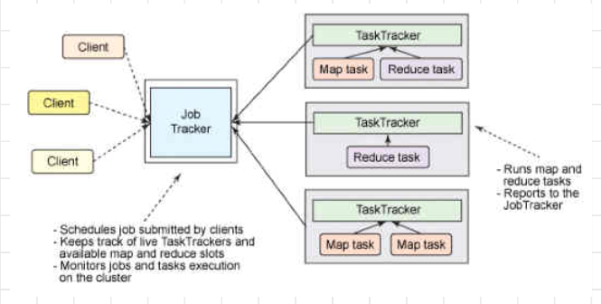

### MapReduce Programming Model

- **Purpose**: Fundamental way to process large amounts of data efficiently.
- **Origin**: Introduced by Google, presented in OSDI '04 (Operating System Design and Implementation).
- **Execution**: Runs on a large set of commodity machines in a distributed manner.
- **Resilience**: Includes checks for failures, ensuring high availability in the distributed computing environment.

**Advantages**
- Parallelly processing the data in a distributed computational environment and thus increases processing performance
- Data Locality – ability to process data where it is, by moving processing to data location, rather than moving data which is more expensive
![[../../Attachments/hdfs20231001.excalidraw.svg]]
%%[[../../Attachments/hdfs20231001.excalidraw.md|🖋 Edit in Excalidraw]], and the [[../../Attachments/hdfs20231001.excalidraw.dark.svg|dark exported image]]%%

*Where is Map output written to?*
-  Local disk and not HDFS 
- Why? Temporary output to be discarded after reduce. 
- Failure: If the node running the map task fails  before the output has been consumed by reducer, automatically rerun map task on another node
#### MR Split Size Considerations

- **Smaller Splits** ⇒ more parallelism
- **Advantages of Small Split Size**:
    - Large number of splits
    - Increased parallelism
    - Improved load balancing
- **Disadvantages of Small Split Size**:
    - Overhead of managing splits and map task creation
    - Less time to execute (task setup and teardown dominates)
- **Optimal Split Size** = HDFS block size (128 MB on v2)
-![[../../Attachments/hdfs20231001_0.excalidraw.svg]]
%%[[../../Attachments/hdfs20231001_0.excalidraw.md|🖋 Edit in Excalidraw]], and the [[../../Attachments/hdfs20231001_0.excalidraw.dark.svg|dark exported image]]%%
During the shuffling stage, the partitioning function ensures all similar keys end up(stay together) at the some reducer

The Default Hadoop partitioner in Hadoop MapReduce is Hash Partitioner which computes a hash value for the key and assigns the partition based on this result.

#### Hadoop 1.0 Job Management

- **Job Tracker (Master-Slave)**:
    - Central component responsible for managing jobs and tasks within a Hadoop 1.0 cluster.
- **Client Submits Job**:
    - The client submits a job to the Job Tracker.
- **Assignment of Mapper and Reducer Jobs**:
    - Job Tracker assigns Mapper and Reducer jobs to available nodes in the cluster.
- **Task Trackers**:
    - Nodes in the cluster have Task Trackers that can receive tasks from the Job Tracker.
- **Job Tracker Responsibilities**:
    - Handles fault tolerance.
    - Manages cluster resource allocation and scheduling of tasks.
    - Overall coordination and supervision of the job's execution.
    - 

**Issues**
1. **Scalability Limitation**:
    - Limited to 4000 nodes per cluster, hindering its ability to handle large datasets.
2. **Availability Single Point of Failure**:
    - The Job Tracker served as a single point of failure, causing potential downtime.
3. **Resource Utilization Problems**:
    - Inefficient resource allocation impacted cluster performance.
4. **Limited to MapReduce Applications**:
    - Hadoop 1.0 primarily supported MapReduce, limiting its versatility for different workloads.

#### YARN (Yet Another Resource Negotiator)

- **Purpose**: YARN is a resource management and job scheduling component in Hadoop that goes beyond MapReduce, allowing various applications to efficiently share and utilize cluster resources.

 - ![[../../Attachments/hdfs20231001_1.excalidraw.svg]]
%%[[../../Attachments/hdfs20231001_1.excalidraw.md|🖋 Edit in Excalidraw]], and the [[../../Attachments/hdfs20231001_1.excalidraw.dark.svg|dark exported image]]%%

1. **Resource Manager**:
    - **Role**: Global resource allocator and scheduler for the entire cluster.
    - **Responsibility**: Manages resource allocation to various applications.
    - **Single Instance**: There is one Resource Manager per cluster.

2. **Node Manager**:
    - **Role**: Per-node agent responsible for resource management on a specific node.
    - **Responsibility**: Monitors resource usage, *reports to the Resource Manager*, and *manages containers on the node.*
    - **Multiple Instances**: Each node in the cluster has its Node Manager.

3. **Application Master**:
    - **Role**: A per-application component responsible for coordinating and managing tasks within a specific application.
    - **Responsibility**: *Negotiates resources* with the *Resource Manager*, *requests* containers from *Node Managers*, and *monitors task execution*.
    - **Multiple Instances**: *Each application* running on the cluster has its *Application Master*.

4. **Container**:
    - **Role**: A lightweight, isolated environment for running application-specific tasks.
    - **Responsibility**: Executes tasks, isolates resources, and *communicates with the Application Master.*
    - **Multiple Instances**: *Multiple containers* can run on a *single node*, *each executing a different task for an application.*

#### Data Locality in MapReduce

- **Optimal Data Locality**:
    - Best when the map task runs on the same node as the input data's location in HDFS.
    
- **Fallback Option**:
    - If all nodes hosting input data are busy, MapReduce looks for a free map slot on a node in the same rack as one of the data blocks.
    
- **Inter-Rack Transfer**:
    - Occasionally, when no local or same-rack slots are available, inter-rack network transfer might be required (cross-rack node).

#### Scheduling in YARN

- **FIFO Scheduler (Earlier Versions)**:
    - In earlier versions of YARN, a FIFO scheduler was used.
    - Each job would utilize the entire cluster.
    - Jobs had to wait for their turn in a first-come, first-served fashion.

- **Balancing Production and Ad-Hoc Jobs**:
    - One challenge in cluster management is finding a balance between production (periodic) jobs and ad-hoc jobs.
    - This balance is often configured in a configuration file.

##### Fair Scheduler

- **Job Pools**:
    - In the Fair Scheduler, jobs are placed into different pools.
    - Each user typically gets their own pool by default.
- **Resource Allocation**:
    - If there's a single job in the queue, it can use the entire cluster.
    - When multiple jobs are waiting, free task slots are distributed fairly among them, ensuring that each user gets their fair share of resources.
- **Managing Job Priorities**:
    - The scheduler considers factors like the length of the queue and job priorities.
    - It ensures a balance between long-running and short-running jobs.
- **Preventing Resource Hogging**:
    - The scheduler prevents a single user from monopolizing the cluster by submitting too many jobs.
- **Custom Pools**:
    - Users can define custom pools with guaranteed minimum capacities for both map and reduce slots.
- **Preemption Support**:
    - The Fair Scheduler supports preemption, allowing resources to be reclaimed from jobs when needed and allocated to others.

##### Capacity Scheduler

- **Queue-based Allocation**:
    - Similar to the Fair Scheduler, the Capacity Scheduler organizes jobs into queues (similar to pools in the Fair Scheduler).
    - Each queue is allocated a specific capacity, e.g., a maximum of 3017 resources.
- **Hierarchical Structure**:
    - Queues can be organized hierarchically, allowing for more complex resource allocation structures.
- **FIFO Within Queues**:
    - Within each queue, jobs are scheduled in a First-In, First-Out (FIFO) order.
- **No Spare Capacity Usage**:
    - Unlike some other schedulers, the Capacity Scheduler does not utilize spare capacity even if it is available.
- **Cluster Segmentation**:
    - In some cases, clusters may be broken up into smaller clusters, each managed separately by its own Capacity Scheduler instance.

#### Failures
![[../../Attachments/map-reduce20231002.excalidraw.svg]]
%%[[../../Attachments/map-reduce20231002.excalidraw.md|🖋 Edit in Excalidraw]], and the [[../../Attachments/map-reduce20231002.excalidraw.dark.svg|dark exported image]]%%

**Zookeeper:** manages cluster (coordination b/w machines,distributed locking , heartbeats)
**Resource Manager**:allocates resources

##### Benefits of YARN

- **Scalability**: YARN is capable of managing very large clusters, making it scalable to handle extensive computational needs.
- **Flexibility**: YARN is flexible and supports a wide range of applications, not limited to Hadoop. It can efficiently manage resources for various data processing frameworks like Hadoop, Storm, and Spark within the same cluster.

Monitor M1, and M2. If M2 is not processing fast enough, M2' is created
If *M2' does better*, **M2 is killed**
If *M2 does better*, **M2' is killed**

   