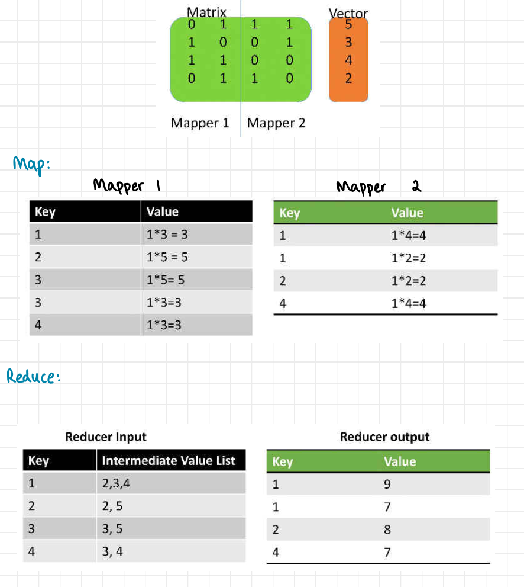
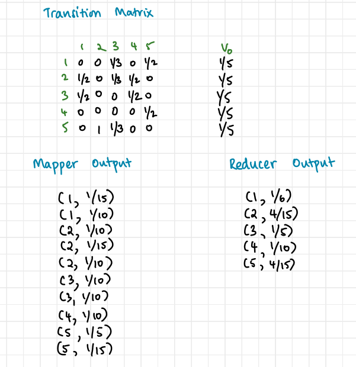
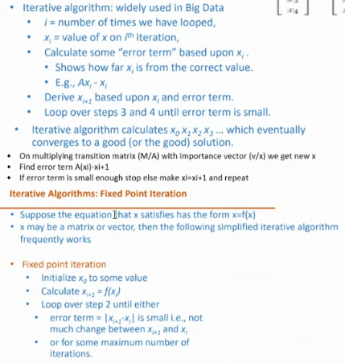

### Matrix representation of the web

![[../../Attachments/Web_page_rank20230928.excalidraw.svg]]
%%[[../../Attachments/Web_page_rank20230928.excalidraw.md|🖋 Edit in Excalidraw]], and the [[../../Attachments/Web_page_rank20230928.excalidraw.dark.svg|dark exported image]]%%

#### Matrix Multiplication with MapReduce

Vertical split of matrix is better as we dont have to hit entire vector in memory

![[../../Attachments/Web_page_rank20230928_0.excalidraw.svg]]
%%[[../../Attachments/Web_page_rank20230928_0.excalidraw.md|🖋 Edit in Excalidraw]], and the [[../../Attachments/Web_page_rank20230928_0.excalidraw.dark.svg|dark exported image]]%%

#### Page Rank

- Cannot use term frequency
- Cannot simply use number of incoming links
- start from a random page and start traversing ; probability of reaching a page from a random page using links (random surfer)
![[../../Attachments/Web_page_rank20230928_1.excalidraw.svg]]
%%[[../../Attachments/Web_page_rank20230928_1.excalidraw.md|🖋 Edit in Excalidraw]], and the [[../../Attachments/Web_page_rank20230928_1.excalidraw.dark.svg|dark exported image]]%%

##### Map reduce implementation
Mapper stage outputs(k,v) pairs where key is name ofthe page (index in vector v) and value is the transition probability ✗ the initial value in v

