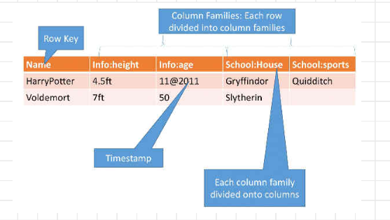

### Why Columnar

**HDFS - Not good for**:

1. **Record Lookup:**
   - *Latency:* HDFS is optimized for high-throughput data access, not low-latency random access. When you need to look up specific records or perform point queries on data, HDFS may not be the best choice. It's not designed for fast record-level retrieval, as it involves seeking data across distributed storage nodes.

2. **Incremental Addition of Small Batches:**
   - *Write Overhead:* HDFS is optimized for handling large files efficiently. When you continuously add small batches of data, it can lead to a significant overhead in terms of file creation, replication, and management. Each small batch may result in a new file, which can be inefficient.(block size)

3. **Updates:**
   - *Immutability:* HDFS is designed around the concept of immutability, meaning that once data is written, it is typically not updated in place. Instead, you create new versions of the data. This makes it less suitable for use cases where frequent updates or in-place modifications of data are required. Updating data in HDFS can be complex and inefficient.

Hive has the additional problem of unstructured and semistructured handling

Which method does less I/O for:
1. Analyzing the relationship between age and earnings:Column
2. Adding a new row or reading a row:Row

**Hbase**
- Distributed column-oriented database built on top of HDFS (Hadoop Distributed File System).
- Data is logically organized in rows and columns within tables.

**Cassandra**
- Distributed database designed for peer-to-peer (P2P) architecture (used by Facebook).
- Inspired by Dynamo DB, a highly available and scalable NoSQL database.

**Hbase / Cassandra**
- Both Hbase and Cassandra utilize the same data model inspired by Google's Bigtable. This model allows for flexible storage of data in tables with rows and columns, making them suitable for handling large-scale, distributed data storage and retrieval.

#### HBase

**Hbase Schema: Several Tables**
- In Hbase, data organization revolves around multiple tables.
- Each table is composed of a set of column families.
- Unlike traditional relational databases, Hbase allows flexibility in terms of column addition or modification without the need to alter the entire schema. This dynamic aspect is particularly valuable for managing evolving data requirements.

**Columns Not Part of Schema**
- Unlike traditional relational databases where all columns must be defined in the schema beforehand, Hbase allows columns to be created on-the-fly without predefining them in the schema.
- This flexibility means that you can insert data with new column names without altering the table schema in advance.

**Hbase: Dynamic Columns**
- Hbase's dynamic columns feature allows you to add columns to a table dynamically without altering the underlying schema.
- In Hbase, column names are encoded inside the cells themselves. This means that the structure of the data can evolve over time as new columns are introduced.
- This dynamic approach simplifies handling semi-structured or rapidly changing data, which is common in big data and NoSQL scenarios.

**Hbase Data Model**
Semi structured
Data partioned and spread across cluster

**Hbase Architecture Components**

**1. Master Server**

- _Manages_ the Hbase cluster.
- _Assigns regions_ to Region Servers on startup, recovery, and load balancing to achieve _balanced data distribution_.
- _Detects failures_ and issues within the cluster through coordination with _Apache ZooKeeper_, a distributed coordination service. It takes corrective actions when a Region Server fails or becomes unreachable, such as _reassigning regions_ to healthy servers.
- _Zookeeper_ listens to region servers and _Active Hmaster_ for heartbeat. If the active one doesn't send a heartbeat, the _inactive one_ that is listening takes over.
- _Monitors Region Servers' performance_ and conducts load balancing, _redistributing regions_ to optimize resource utilization and maintain even data distribution.
- Supports administrative functions, including _schema changes_, _table creation_, and _column family management_. Its role is akin to the _HDFS NameNode_, responsible for managing metadata and data organization in Hadoop's distributed file system.

**2. Region Servers**

- Responsible for _storing and managing data_ in Hbase.
- House _regions_, which represent _subsets of a table's rows_. These regions are _automatically split_ as data grows, ensuring _efficient storage management_ and _even data distribution_.
- Handle client communication and manage _data-related operations_, including both _reading and writing_. They ensure _data consistency and durability_.
- Make decisions regarding _region size and splitting_. If a region becomes too large, it is _automatically divided into smaller regions_ to prevent overloading a single server. This dynamic management is reminiscent of how _HDFS DataNodes_ manage data storage.

**3. Regions**

- Serve as _partitions for Hbase tables_, representing _subsets of a table's rows_.
- Automatically split as data volume increases, facilitating _parallel processing_ and _efficient data distribution_ across Region Servers.
- As data continues to grow, regions are _dynamically split into smaller units_ to maintain an even distribution across the cluster. This _automatic splitting mechanism_ eliminates the need for manual intervention in balancing data distribution.

A _Region Server_ maintains various regions running on top of _[HDFS](https://www.edureka.co/blog/apache-hadoop-hdfs-architecture/)_. Components of a _Region Server_ are:

- **WAL (Write Ahead Log):** As you can conclude from the above image, _Write Ahead Log (WAL)_ is a file attached to every _Region Server_ inside the distributed environment. The _WAL_ stores the new data that hasn’t been persisted or committed to the permanent storage. It is used in case of failure to recover the data sets.
    
- **Block Cache:** From the above image, it is clearly visible that _Block Cache_ resides on top of the _Region Server_. It stores the frequently read data in memory. If the data in _Block Cache_ is least recently used, then that data is removed from _Block Cache_.
    
- **MemStore:** It is the _write cache_. It stores all the incoming data before committing it to the disk or permanent memory. There is one _MemStore_ for each column family in a region. As you can see in the image, there are multiple _MemStores_ for a region because each region contains multiple column families. The data is sorted in lexicographical order before committing it to the disk.
    
- **HFile:** From the above figure, you can see _HFile_ is stored on _HDFS_. Thus, it stores the actual cells on the disk. _MemStore_ commits the data to _HFile_ when the size of _MemStore_ exceeds

**Steps to Write**:

1. The client _retrieves_ the location of the _META table_ from the _ZooKeeper_.
2. The client then _requests_ for the _location of the Region Server_ of the corresponding _row key_ from the _META table_ to access it. The client _caches_ this information with the location of the _META Table_.
3. Then it will _get the row location_ by _requesting_ from the corresponding _Region Server_.

For _future references_, the client uses its _cache_ to _retrieve the location of the META table_ and _previously read row key’s Region Server_. Then the client will not refer to the _META table_, until and unless there is a _miss_ because the region is shifted or moved. Then it will again _request_ to the _META server_ and _update the cache_.

_Step 1:_ Whenever the client has a write request, the client writes the data to the WAL (Write Ahead Log). 

- The edits are then appended at the end of the WAL file.
- This WAL file is maintained in every Region Server and Region Server uses it to recover data which is not committed to the disk.

_Step 2:_ Once data is written to the WAL, then it is copied to the MemStore.

_Step 3:_ Once the data is placed in MemStore, then the client receives the acknowledgment.

_Step 4:_ When the MemStore reaches the threshold, it dumps or commits the data into a HFile

##### **HBase Write Mechanism - MemStore**

- In the _"EmployeeData"_ table, when new _employee records_ are added or existing ones are updated, the changes are initially stored in _MemStore_.
- For example, if we add a new employee named _"John Doe"_ with his _personal_ and _salary information_, these updates go to _MemStore_ for both the _"PersonalInfo"_ and _"SalaryInfo"_ column families.

##### **HBase Architecture: HFile**

- As the _MemStore_ accumulates updates, it sorts them lexicographically. Let's say we add more employees like _"Alice Smith"_ and _"Bob Johnson."_ Their updates are also stored in _MemStore_.
- When the _MemStore_ reaches a threshold, it flushes its data into new _HFiles_ in _HDFS_. In our example, this would create _HFiles_ for both _"PersonalInfo"_ and _"SalaryInfo"_ column families. These _HFiles_ are stored in _HDFS_.

##### **HBase Architecture: Read Mechanism**

- When a client wants to read data from the _"EmployeeData"_ table, it goes through the following steps:
    1. First, it checks the _Block cache_ (like a cache of recently read data) for any previously retrieved key-value pairs.
    2. If the data is not found in the _Block cache_, it looks in the _MemStore_ for recently written data not yet in _HFiles_. For example, if we want to read _"John Doe's"_ information, we'll find it in _MemStore_.
    3. If the data is still not found, the client uses _bloom filters_ and _block cache_ to load the data from the relevant _HFiles_ in _HDFS_. For instance, if we want to read _"Alice Smith's"_ information, it would be retrieved from _HFiles_.

Cells have row_id,column,timestamp/version

#### Cassandra

- **Origin**: Cassandra _originates_ from Bigtable and Amazon's DynamoDB.
    
- **Open Source**: Cassandra is an _open-source_, _columnar NoSQL database_, similar to Hbase.
    
- **P2P (Peer-to-Peer)**: Cassandra follows a _peer-to-peer architecture_ rather than a master-slave architecture, where all nodes in the cluster have equal roles and responsibilities. _Each node can handle reads/writes._
    
- **Elastic Scalability**: Cassandra supports _elastic scalability_, allowing the cluster to easily increase the number of nodes. This scalability feature enables Cassandra to handle growing data and traffic loads.
    
- **Replication for Failure Prevention**: Cassandra ensures data availability and fault tolerance by _replicating data_ across multiple nodes. In case of node failures, data can be retrieved from replicas, preventing data loss.
    
- **Dynamically Accommodates Changes**: Cassandra can _dynamically accommodate changes_ to the cluster, such as adding or removing nodes, with minimal disruption to operations.
    
- **Data Organization**: Data in Cassandra is organized into _partitions_. Each partition contains a set of rows, and these partitions are distributed across the cluster.
    
- **Partition**: A _partition_ in Cassandra is a fundamental unit of data distribution and storage. It contains rows of data and is identified by a unique _partition key_.
    
- While inserting, give a _partition key_, and data with the same partition ends up in a node.
    
- Supports _ACID_ (atomicity, consistency, isolation, durability).

| Aspect                 | Cassandra                               | HBASE                                |
|------------------------|-----------------------------------------|--------------------------------------|
| Request Coordination    | Over partitioned dataset                | Through master                        |
| Node Organization      | Nodes organized as rings                | Organized as regions, handled by region server |
| Failure Handling       | Handled by nodes                        | Failure handled by ZooKeeper, membership handled by master server |
| Storage Engine         | Local storage engine, independent of HBASE or HDFS | Built on top of HDFS                 |
| Query Language         | CQL (Cassandra Query Language), richer than Hbase query language | Hbase query language isn't as rich  |

