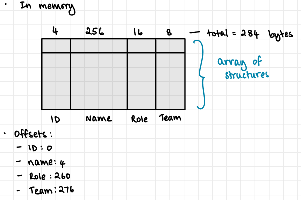
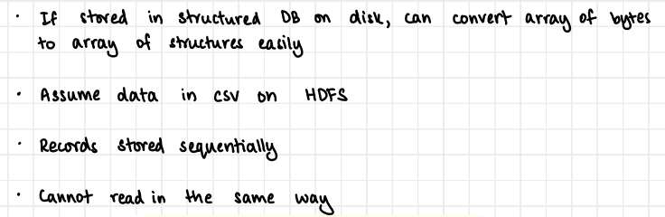
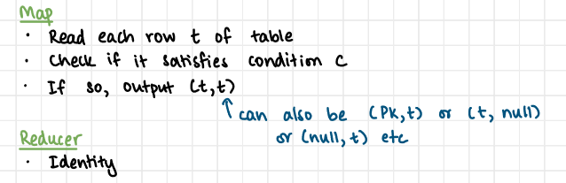
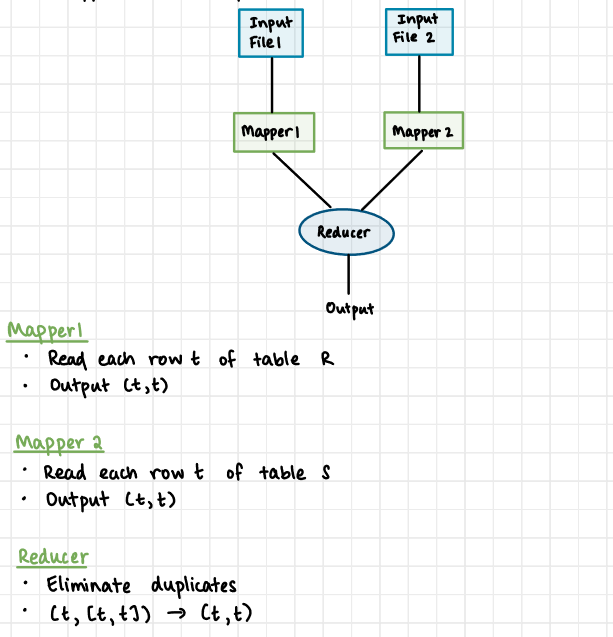
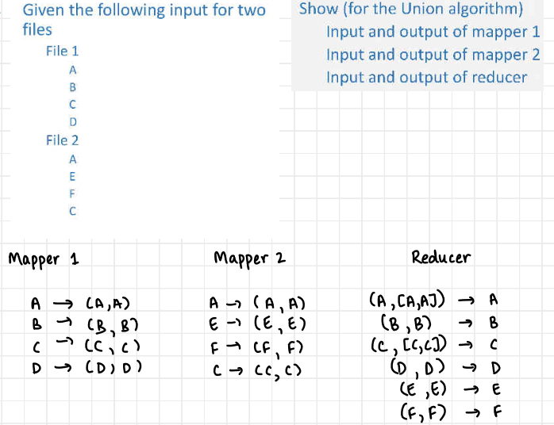
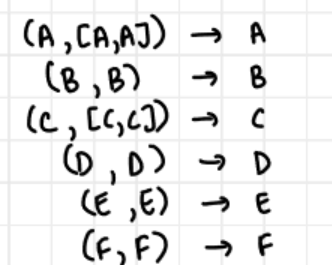
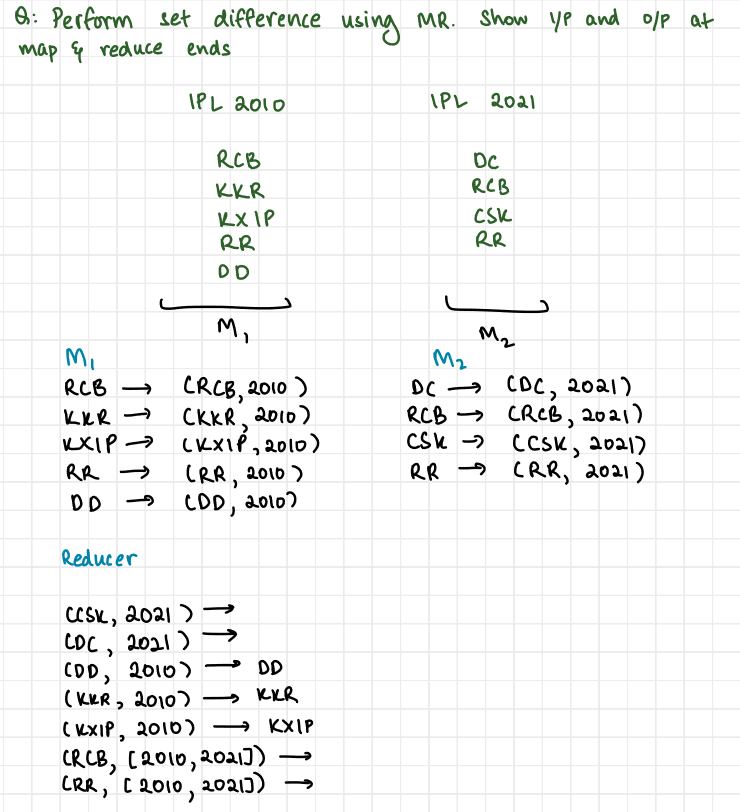
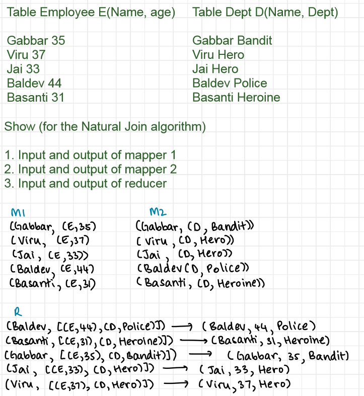
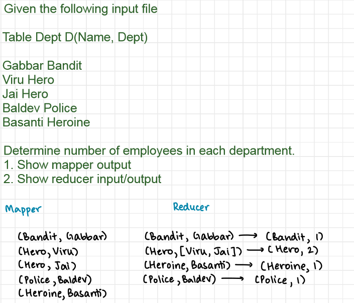

### Select in Map Reduce

### Union

### Intersection

but you have to print only those with duplicates
also in case each file has duplicates, mapper should tell which file it is from

### Set Difference

### Natural Join

### Aggregate
