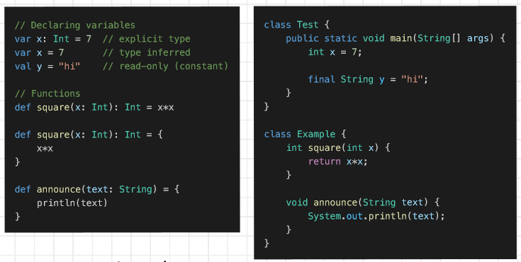
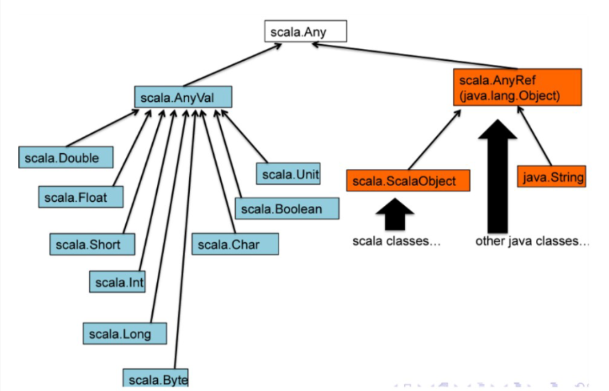

### Issues with Hadoop

- **Issue with Small Files**:
    
    - Doesn't suit small data files, leading to a waste of storage space (high capacity design).
    - Small files (<128 MB) that are smaller than HDFS block size are inefficient.
    - Too many small files can cause problems for managing the NameNode.
- **Slow Processing Speed**:
    
    - Data distribution and processing in MapReduce across a cluster can result in slower processing speeds due to data movement.
- **Supports Batch Processing Only**:
    
    - Hadoop is primarily designed for batch processing and is not well-suited for streaming data processing.
- **No Delta Iteration**:
    
    - Hadoop is not efficient for iterative processing tasks.
    - It does not support cyclic data flow, making certain iterative algorithms less efficient to implement.

### Apache Hadoop and Apache Spark

- Both open-source frameworks for big data processing.
- **Hadoop** uses **MapReduce** for data processing.
- **Spark** uses **Resilient Distributed Datasets (RDDs)** for processing.
- Hadoop has **HDFS** for distributed file storage.
- HDFS is scalable; servers/machines can be added for more data.
- Spark doesn't have its own file system; it relies on Hadoop's HDFS.
- Spark can run independently or with Hadoop.
- Spark can create distributed datasets from HDFS files.

#### RDD
**Resilient Distributed Datasets**
- RDDs are a distributed collection of data that can be processed in parallel across a cluster of machines.
- They are **resilient** because they automatically recover from node failures, ensuring fault tolerance.
- RDDs are **distributed** as they can span multiple nodes in a cluster.
- RDDs support two types of operations: **transformations** (which create new RDDs from existing ones) and **actions** (which return values to the driver program or write data to external storage).
- RDDs are typically created from data in Hadoop Distributed File System (HDFS) or by transforming existing RDDs through operations like map, filter, and reduce.
### Apache Spark and Scala

- **Spark** is an open-source distributed general-purpose cluster-computing framework.
- **Scala** is a general-purpose programming language.
- Spark enhances Hadoop's computational processes.
- Scala supports functional programming and has a strong static type system.
- Scala can be used for web apps, streaming data, distributed apps, and parallel processing.

`Scala, on the other hand, is a general-purpose language used for various applications, including Spark.`


### Scala
- **Scalable Language**.
- **Object-oriented**, compiled into Java bytecode (runs on JVM).
- Can reference Java libraries.
- Blends Object-Oriented (OO) and Functional Programming (FP).
- Strongly, statically typed.

**What's wrong with Java?**:
- Verbose (boilerplate code).
- Not designed for high concurrency before Java 5+7.

**What's right with Java?**:
- Popular.
- Object-Oriented.
- Strongly typed.
- Large library of classes.
- JVM platform-independent.
- It is backwards compatible(not scala)

### Java vs Scala:

- Almost completely interoperable.

### Major Differences:





1. **Minimal verbosity**.
	![[../../Attachments/scala20231002.excalidraw.svg]]
%%[[../../Attachments/scala20231002.excalidraw.md|🖋 Edit in Excalidraw]], and the [[../../Attachments/scala20231002.excalidraw.dark.svg|dark exported image]]%%


2. **Referential Transparency**:
    - Type inference in Scala.
    - Compiler checks types of sub-expressions and atomic values.

```
val collegeName = "PES University" // const reference
def squareOf(x: Int) : x * x // def method that cannot be reassigned
```

**Java:**
- Every value is a type, except primitive types like `int` and `boolean`, which are not objects, for efficiency reasons.
- Java has operators that are distinct from methods and have different syntaxes.

**Scala:**
- Every value in Scala is an object; even primitives are turned into objects by the compiler for efficiency.
- 
- In Scala, operators are treated as methods, and you can use either operator or method syntax for operations.


3. **Concurrency**:

	- **The actor model** in computer science is a mathematical model of concurrent computation that treats an actor as the basic building block of concurrent computation. In response to a message it receives, an actor can: make local decisions, create more actors, send more messages, and determine how to respond to the next message received. Actors may modify their own private state, but can only affect each other indirectly through messaging (removing the need for lock-based synchronization).
	
	- **Akka** open-source framework for Actor-based concurrency.
	
	-  **Fine-Grained Concurrency**:
	    - Involves frequent interactions between threads working together.
	    - Complex to implement correctly.
	    - Requires locks on shared resources.
	    
	- **Coarse-Grained Concurrency**:
	    - Involves infrequent interactions between largely independent sequential processes.
	    - Easier to implement correctly.
	    - Example: Map-Reduce.
	    - Operates at a higher level, not at the cycle level.
	    
	- **Java**:
	    - Offers reasonable support for fine-grained concurrency.

	- **Scala**:
	    - Accesses the Java API for concurrency.
	    - Provides Actors for coarse-grained parallelism.
	        - Actors use message passing with `send !` abstraction.
	        - Useful for simplifying parallel programming in Scala, especially for map-reduce-like tasks.


4. **Functional Programming**:
	- **lightweight syntax for anonymous function**
	- **supports currying** : functions with multiple arguments transformed into single argument functions
	- **supports singleton objects**

	- **Impure Functional Language**:
		- Scala allows programming in a functional style, but it doesn't force functional programming upon you.
	
	- **Immutable**:
		- Functional operations create new data structures and do not modify existing ones.
	
	- **Data Flow Capture**:
		- Programs in Scala implicitly capture data flow.
		- Operations like `map`, `filter`, and `reduce` on collections. When you apply these operations to a collection, you're defining a sequence of transformations to be applied to the data. These transformations describe the data flow, and Scala takes care of executing them in the proper order.
		- Scala allows you to compose functions easily. You can chain multiple functions together to form a data transformation pipeline, capturing the flow of data from one step to the next.
	
	- **Order of Operations Unimportant**:
		- The order of operations is not crucial, enhancing flexibility.
	
	- **Functions as Objects**:
		- Functions in Scala are treated as objects.
		- They can be arguments, returned from other functions, and operate on collections.
	
	- **Concurrency and Locks**:
		- Scala's features (due to functional programming) reduce the need to worry about concurrency and acquiring locks, making concurrent programming more manageable.

	![[../../Attachments/scala20231002_0.excalidraw.svg]]
%%[[../../Attachments/scala20231002_0.excalidraw.md|🖋 Edit in Excalidraw]], and the [[../../Attachments/scala20231002_0.excalidraw.dark.svg|dark exported image]]%%


	![[../../Attachments/scala20231002_1.excalidraw.svg]]
	%%[[../../Attachments/scala20231002_1.excalidraw.md|🖋 Edit in Excalidraw]], and the [[../../Attachments/scala20231002_1.excalidraw.dark.svg|dark exported image]]%%

5. **Lazy evaluation and operator overloading**
```
val geeks = List(1, 2, 3, 4, 5)
lazy val output2 = geeks.map(l=> l*5)
println(output2)


The value isn’t calculated till we use output2 that’s till println(output2). 

Why lazy evaluation?

In the example what if we never use the output value? We wasted our map operation (CPU computations) which can be very costly when we write more complex and bigger code.
```

Java doesn't support operator overloading
```
class Complex(val real : Double, val imag : Double) {
   
  def +(that: Complex) =
            new Complex(this.real + that.real, this.imag + that.imag)
   
  def -(that: Complex) =
            new Complex(this.real - that.real, this.imag - that.imag)
 
  override def toString = real + " + " + imag + "i"
   
}
 
object Complex {
  def main(args : Array[String]) : Unit = {
       var a = new Complex(4.0,5.0)
       var b = new Complex(2.0,3.0)
       println(a)  // 4.0 + 5.0i
       println(a + b)  // 6.0 + 8.0i
       println(a - b)  // 2.0 + 2.0i
  }
}
```