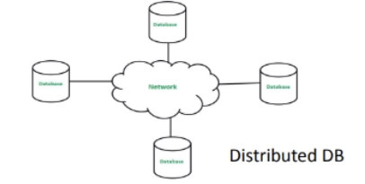
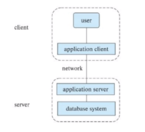

# Database Architecture

#### Centralized databases
- Single shared database
- Easy Consistency
- Limited scalability

#### Client Server
- Server executes queries on behalf of many clients.

#### Parallel databases
- Design to run on a cluster of machines
- better scalability
- Many cores and many disks

#### Distributed databases
- Data spread across geographically separated machines.
- Facilitates large scale data management
- Schema heterogeneity

#### Two Tier Architecture
- Client applications directly access database

#### Three Tier Architecture
- Client application cannot directly access the db.
- Client invokes server application which can access the db and return the data.

