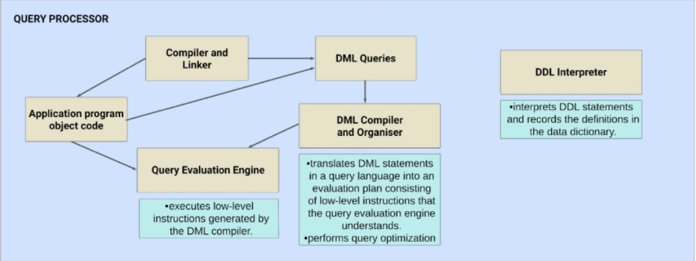
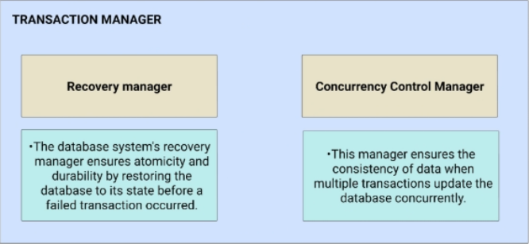

# Database Engine

### Storage Manager
- Interacts with OS's File Manager
- Efficient Storing, retrieving and updating the DB.
- Creates several data structures as a part of the physical implementation.

### Query Processor
- DDL Interpreter
- DML Compiler

### Transaction Manager
-  Recovery manager - Rollbacks and ensuring transaction atomicity.
- Consistency manager - ensures data consistency across multiple transactions.

[Database Architecture](database-architecture.md)