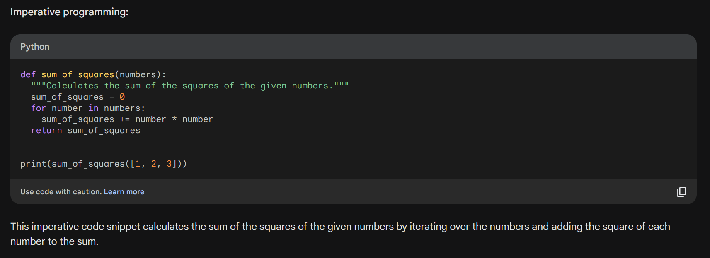
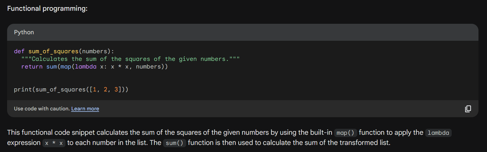
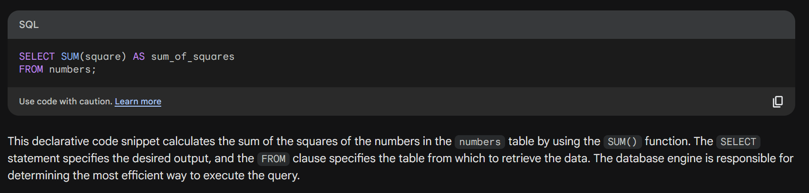

# Relational Query Language

#### Imperative Query Language
Programming paradigm that focuses on describing how a program should execute. Imperative programs are typically written as a sequence of statements, each of which tells the computer what to do next.

#### Functional Query Language 
programming paradigm that focuses on describing what a program should compute, rather than how it should compute it. Functional programs are typically written as a composition of functions, each of which takes a set of inputs and produces a set of outputs.

#### Declarative Query Language
programming paradigm that focuses on describing what a program should achieve, rather than how it should achieve it. Declarative programs are typically written as a set of constraints or rules, which the computer can use to reason about the desired solution.

