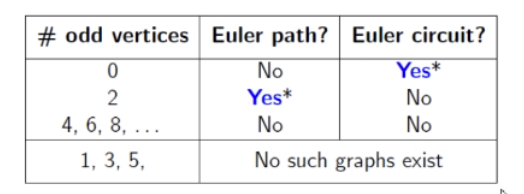

# Eulerian Graph

- **Walk** Alternating sequence of edges and vertices
- **Trail** Walk where edges aren't repeated
- **Path** Walk where vertices and edges are visited at most once
- **Circuit** Start end vertex same, no edges are repeated (closed trail)
- **Cycle** Start end vertex same, no edges or vertices are repeated (closed path)

**Euler Graph** Connected graph where you can traverse the entire graph without repeating edges
**Euler path** walk that uses every edge only once. Vertices can repeat. Start end vertex are different.
**Euler Circuit** Circuit that uses every edge exactly once. Start end vertex is the same.

### Theorems
- A Connected graph G is Eulerian iff all vertices of G are of even degree.
- A Connected graph G is Eulerian iff it can be decomposed into cycles.

- **Euler graph** has Euler circuit.
Has no Odd degree vertices
- **Semi-Eulerian** has Euler path.
Has exactly 2 odd degree vertices

**Bridge** an edge that is the only edge connecting two sub-graphs.
Removing bridge disconnects the graph.

#### Fleury's Algorithm to find Euler path
1. Start at odd degree vertex, if any
2. Follow edges, and remove them once visited.
3. Chose non-bridge,whenever possible
4. repeat until no edges.

### Euler Graph for DiGraph
1. All vertices with non zero degree are part of strongly connected component
2. In-degree == out-degree

#### Hierholzer's Algorithm
**To find Euler circuit in Di-Graph**
- Start at vertex and find cyclic components.
- Insert on cycle into another cycle to form a bigger cycle.
- Repeat until all edges traversed.

[Hamiltonian Graph](hamiltonian-graph.md)