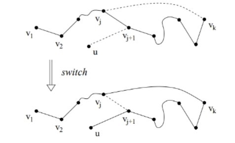

# Hamiltonian Graphs
A graph where a path exists which visits all the nodes exactly once. 

**Hamiltonian Path** is a path which visits all the vertices, but need not end up at the starting vertex. 
**Hamiltonian Cycle** is a circuit which visits all the vertices and ends up at the starting vertex. 
**Hamiltonian Graph** Graph that contains Hamilton cycle

*Note: Finding Hamiltonian path and circuit for a general graph is NP hard and no algorithm exists to find them, but algorithms have been designed for special types of graphs*

### Dirac's Theorem
A simple graph with n>=3 and degree of every vertex is >=n/2, then the graph is Hamiltonian.

#### Path construction
<u>Case I</u>  Current node $V_k$ has a node $V_{k+1}$ not in path. Add the edge connecting $V_k$ to $V_{K_1}$ to the Path.

<u>Case II</u>  The second case is when all neighbors of $v_k$ are on P. The idea is this: We will show that there is a neighbor $v_j$ of $v_k$ such that $v_{j+1}$ has a neighbor outside P. Then we will perform a switch operation that transforms P into the following path: $v_1$ $v_2$ ...$v_j$ $v_k$ $v_{k−1}$...$u$, as in the figure below:

- All $K_n$ is Hamiltonian
- In $K_{m,n}$ if m=n, it is Hamilton cycle, if |m-n| $\leq$ 1 it has Hamilton path

[Trees](trees.md)