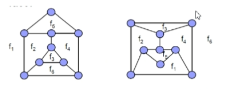
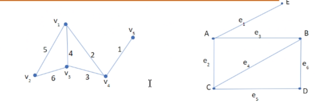

# Planar Graphs
A graph G is planar if it can be drawn on a plane surface with no two edges intersecting

**Homeomorphic Graphs**  two graphs are said to be homeomorphic if one can be obtained by
- removing vertices with degree 2 and connecting the vertices the removed vertices was connected to. 
- a vertex is embedded into an edge to connect two other vertices.

#### Kuratowski's Theorem
A necessary and sufficient condition to prove a graph G is planar is to see if the graph is not 
- $K_5$ 
- $K_{(3,3)}$
- should not contain either as a subgraph.

##### Simple Test for planarity
- e<9 or n<5, graph is planar
- e>3n-6, graph must be non-planar
*Note: Not sure condition*

#### Preprocessing for Planarity
- Test each disconnected component separately.
- If the graph has cut vertices, test each block if it is also planar.
- Loops can be removed
- Parallel edges can replaced with one edge.
- Can perform Homeomorphic reduction
- Apply over and over until testable by simple test or kuratowski

## Faces
A planar representation of a graph divides the plane into a number of connected regions called **faces**

##### Euler's theorem on planar graphs
If a connected planar graph G has n vertices, e edges and r regions
$n-e+r=2$ 

## Isomorphism
Two graphs are said to be isomorphic if there is a one-one correspondence between their vertices and edges.

