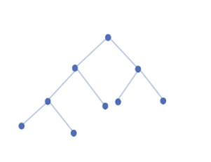
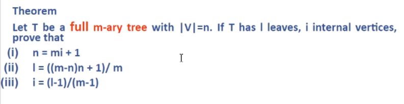
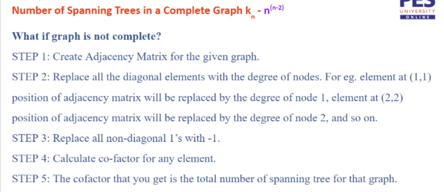
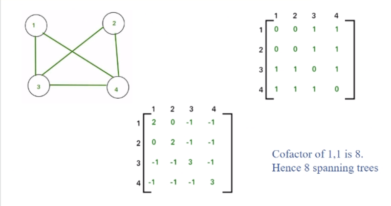

# Trees

Undirected loop free subgraph of given graph.
Collection of disconnected trees - forest.

**Spanning Tree** Tree of a graph that contains all vertices of the graph
Spanning tree has n-1 edges.

In a forest of spanning trees **$n =m+k$**
where n- no. of vertices
m - no of edges
k - no of trees in G

**Branch Set** edges in tree
**Chord Set** edges no in tree
##### Rooted Trees
- **Rooted Tree** Directed Tree such that only one vertex has degree zero. This its the Root ode.
- **Leaves**(l) are nodes with zero out-degree. Internal Vertices(i) are non-leaf.
- **n-ary tree** every vertex at most n out-degree, or **n children**.

**A complete Binary Tree** - if all the levels are completely filled except possibly the last level and the last level has all nodes as left as possible.

**Balanced Tree** $|height\ of\ left\ subtree - height\ of\ right\ subrees | < 1$for all sub-trees.

**Full Binary tree** complete tree where all leaves are at same level.

no of spanning trees in complete graph = $n^{n-2}$

#### Calculating number of Spanning Tree

1. Create adjacency matrix for a given graph. 
2. make all diagonal elements the degree of that node Eg. $(1,1)$ will be replaced with the degree of node $1$.
3. Replace the non diagonal $1's$ to $-1$.
4. calculate the co-factor for any element in the matrix.
5. The result will give you the number of spanning trees for the graph.

[Cut Sets](cut-sets)