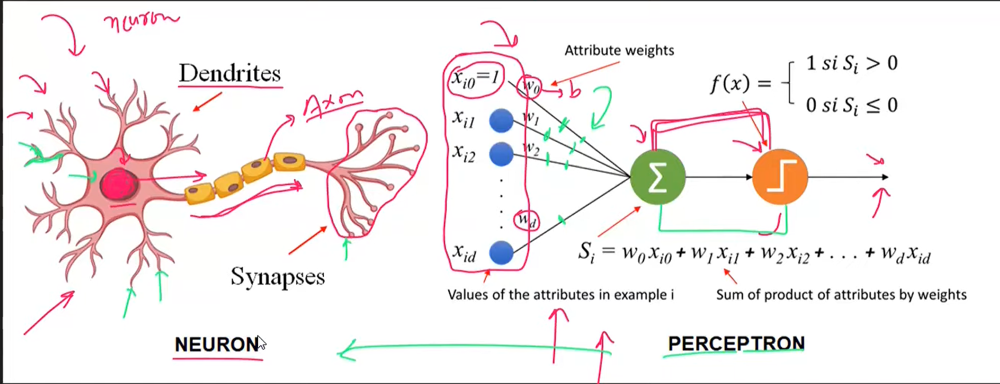
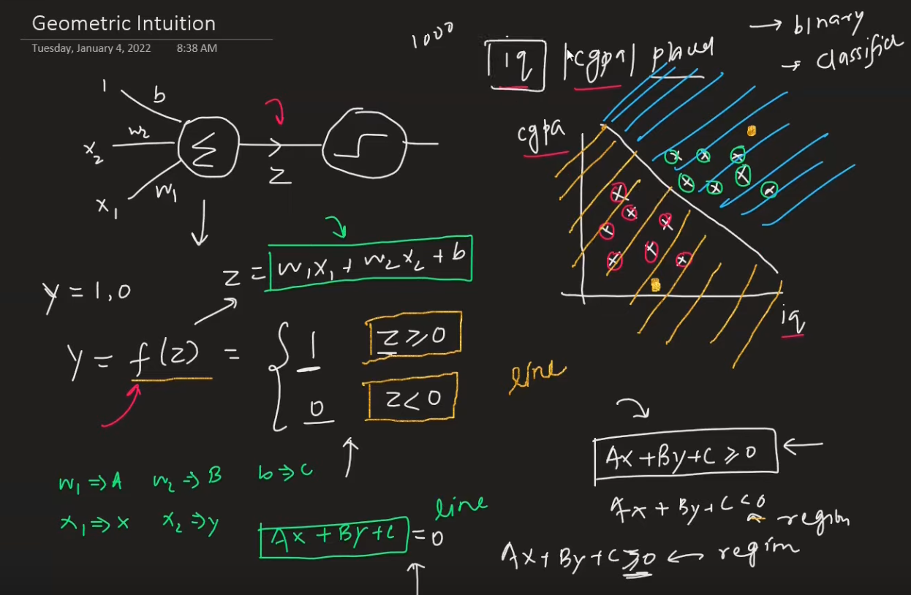
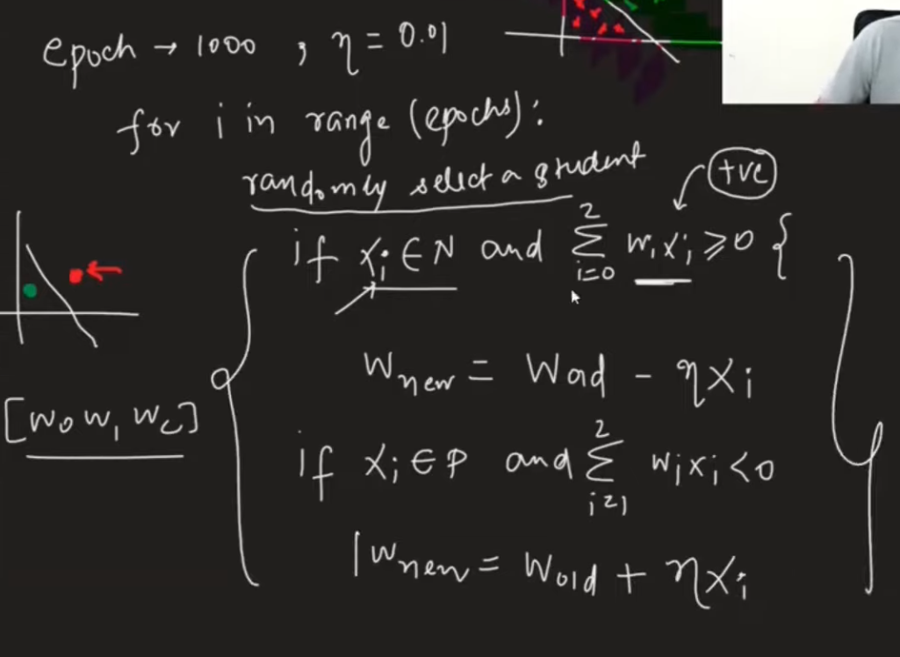
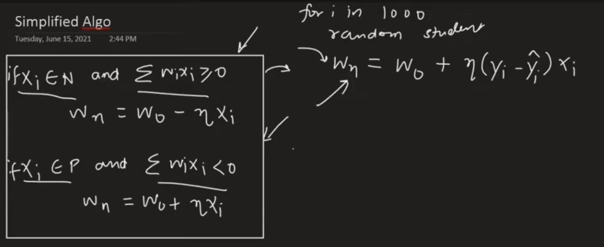
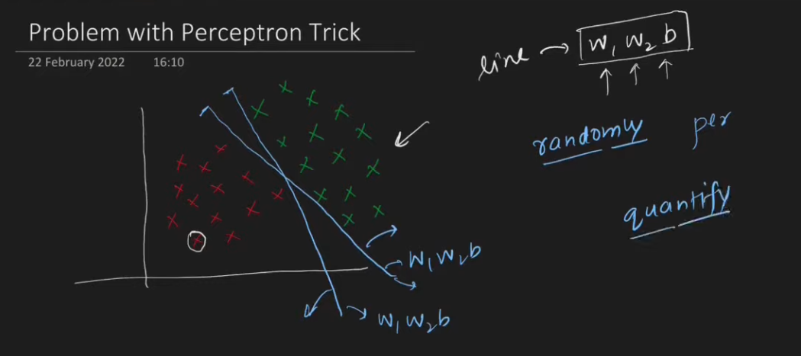
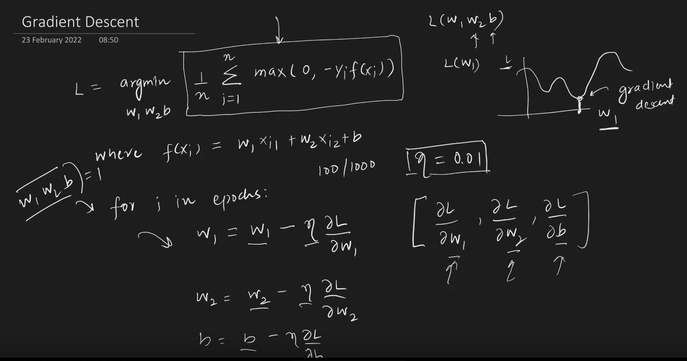
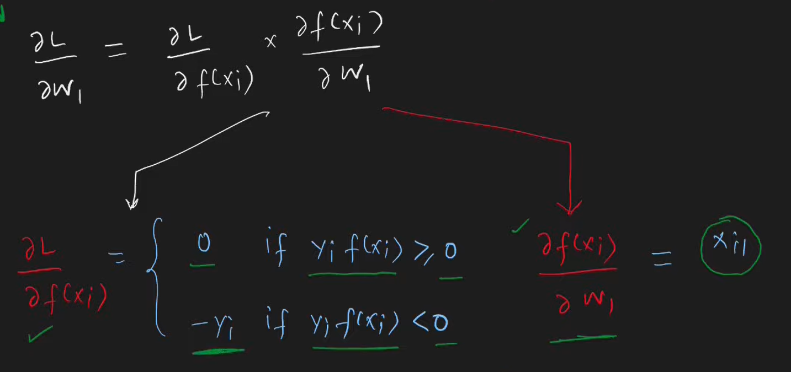
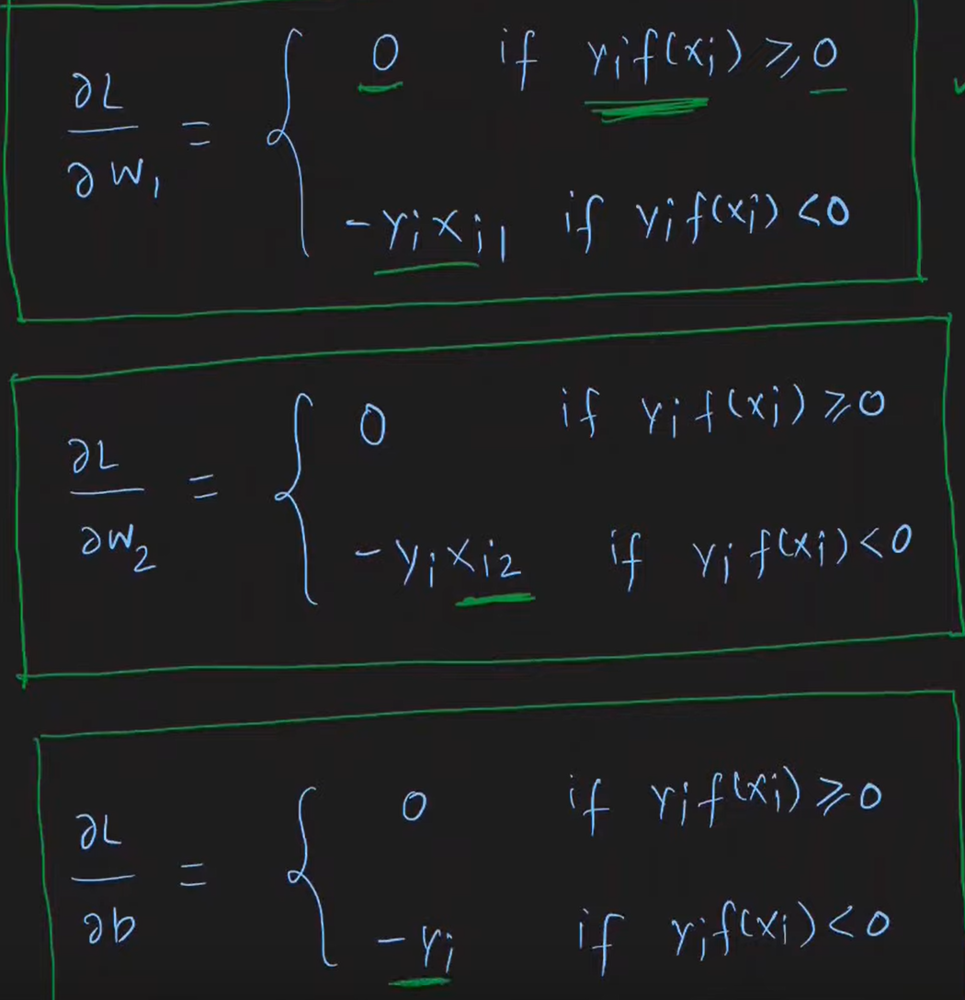

#### Differences:
- Complexity
- Processing logic
- Neuroplasticity

#### Geometric Intuition

In 3D
$ax + by + cz + d \geq 0$
Equation of a plane, in 4D we get a hyperplane.

**Works only with linear or sort of linear data**

#### How to train

#### Problems with perceptron trick

1) Which line is better?
2) Problem with convergence, if you don't select random points properly, line wont move

**Use loss functions**
1) using distance formula is complex, instead substitute point in line, we get a $quantity \propto distance$
$$
L=\frac{1}{n} \sum_{i=1}^{n} max(0,-y_i f(x_i))
$$

for correct predictions, $y_i$ and $f(x_i)$ (prediction) have same sign, so the above returns 0 error 

| Loss function | Activation | Output |
| ------------- | ---------- | ------ |
|    Hinge Loss           |Step            |  perceptron-binary|
|log loss(binary cross)|sigmoid|logistic regression|
|categorical cross|softmax|softmax regression|
|mse|linear|linear regression|

#### Problems with Perceptron

Fails with non linear data

