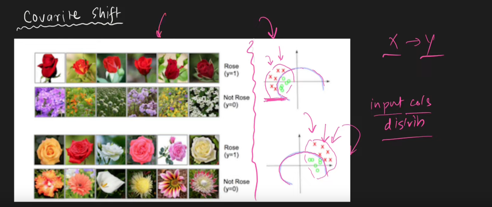
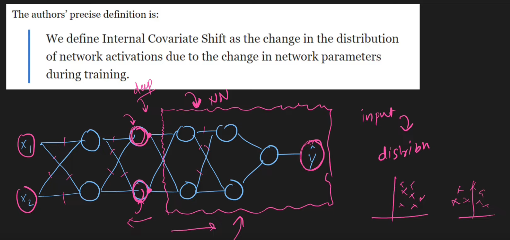
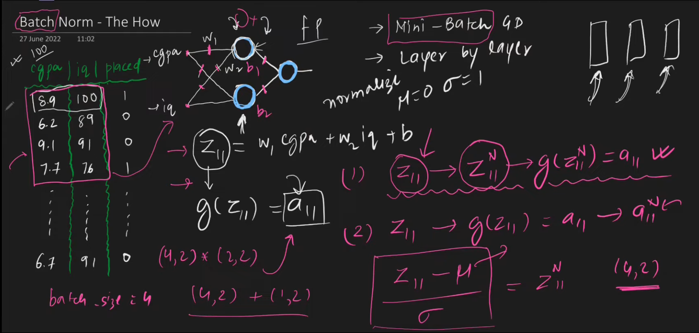
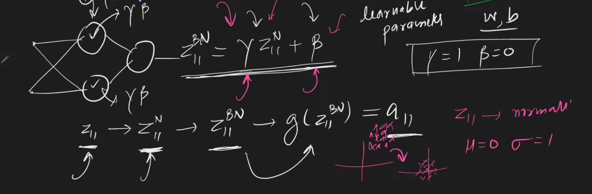

### Why Batch Normalization

Makes training of *DNN faster* and *more stable*
Normalize not only input, but *activations* also
*Normalization* is making *mean->0* and *standard deviation->1*

- Unnormalized data, loss *function is stretched*->*influence of some weights more than others*(similar to sparse data problem)
- 
- When you change input distribution->trouble in training(even though its essentially the same input)
- 

### How it's done

On mini batch gradient descent 
 
 ![[../../Attachments/batch-normalization20230929.excalidraw.svg]]
%%[[../../Attachments/batch-normalization20230929.excalidraw.md|🖋 Edit in Excalidraw]], and the [[../../Attachments/batch-normalization20230929.excalidraw.dark.svg|dark exported image]]%%

**why are we scaling and shifting, doesnt that defeat the purpose?**

if $\gamma=\sigma+E$  and $\beta=\mu$ then there was no point of doing

We do it to give the network an option to choose whether and how much normalization to apply depending on necessity

**But wait !**
What about testing data?
We wont be giving batches

We use exponentially weighted moving average of means and sd's of training data that we can use.
During training  neuron stores $(\gamma,\beta)\rightarrow trainable\;(\mu,\sigma)\rightarrow non trainable$

### Advantages

- More stable, we can use wider hyperparams
- that leads to faster training
- regularization effect $\mu,\sigma$ (affected by batch) can affect activation which can introduce randomness
- dont have to weight initialize as much(small weight on flat ground due to elongation of loss,why is loss elongated, because of unnormalized data!)

