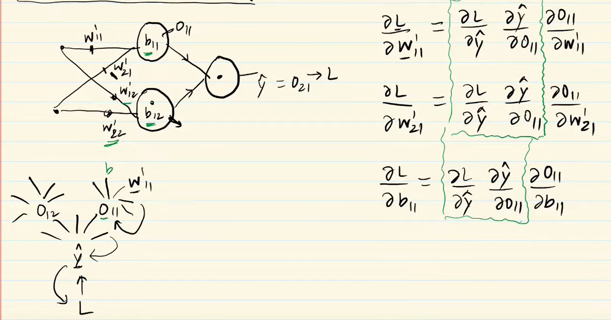
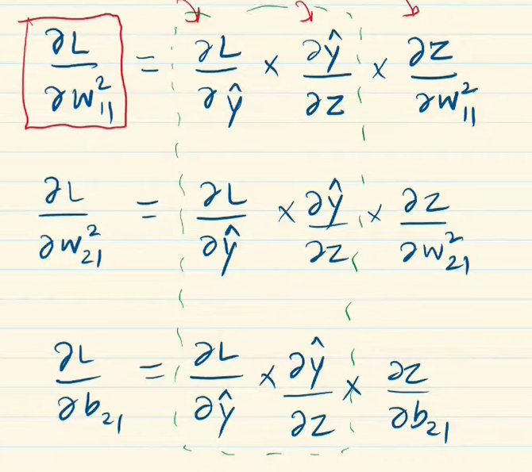
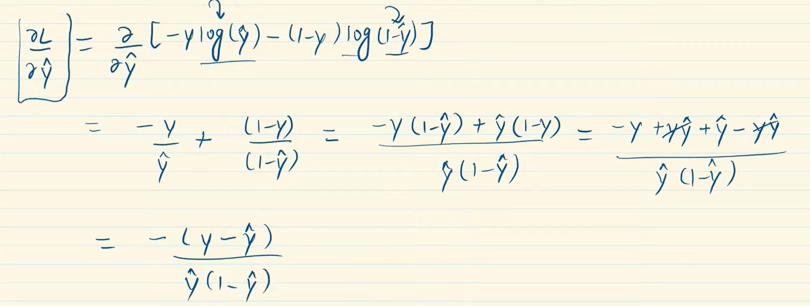
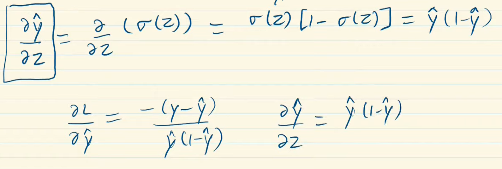
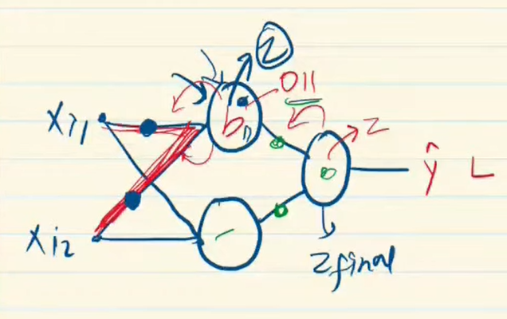
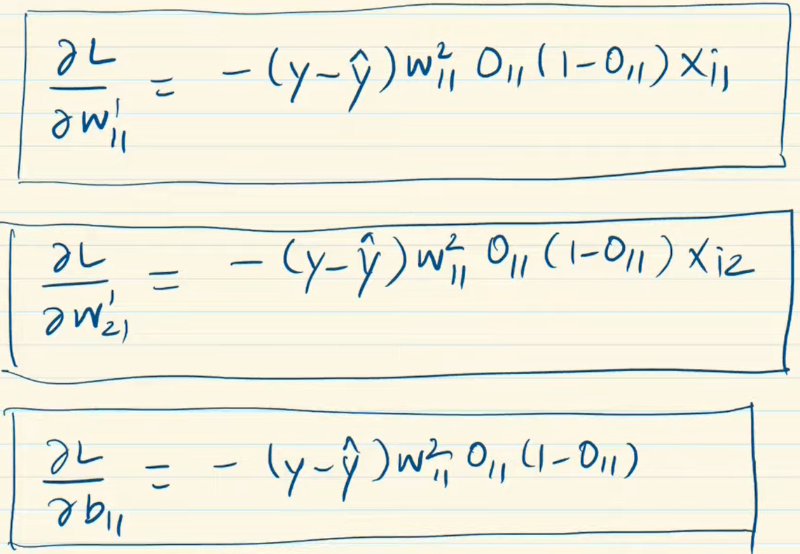
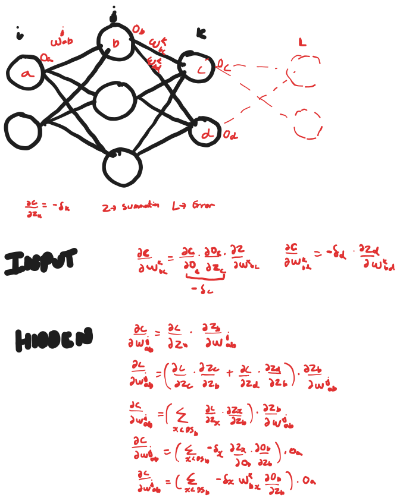

### The Chain Rule

$$1)\;\frac{\partial L}{\partial{\hat{y}}}$$
$$2) \; \frac{\partial{\hat{y}}}{\partial{O_{11}}}$$
$$3) \; \frac{\partial{\hat{y}}}{\partial{O_{12}}}$$
Then find the other derivatives

*green box is common*

**1)** 
**2)** 

**1 x 2 :**
$\frac{\partial L}{\partial Z}=-(y-\hat{y})$

[Multi Class bwd](bwd_multi.excalidraw.md) 
a
%%[[../../Attachments/bwd2023-09-27,21.19.57.excalidraw.md|🖋 Edit in Excalidraw]], and the [[../../Attachments/bwd2023-09-27,21.19.57.excalidraw.dark.svg|dark exported image]]%%

Start backwards and memoize, later derivatives will be used, no need to calculate

