# Convolutional Neural Networks

Sequence Learning
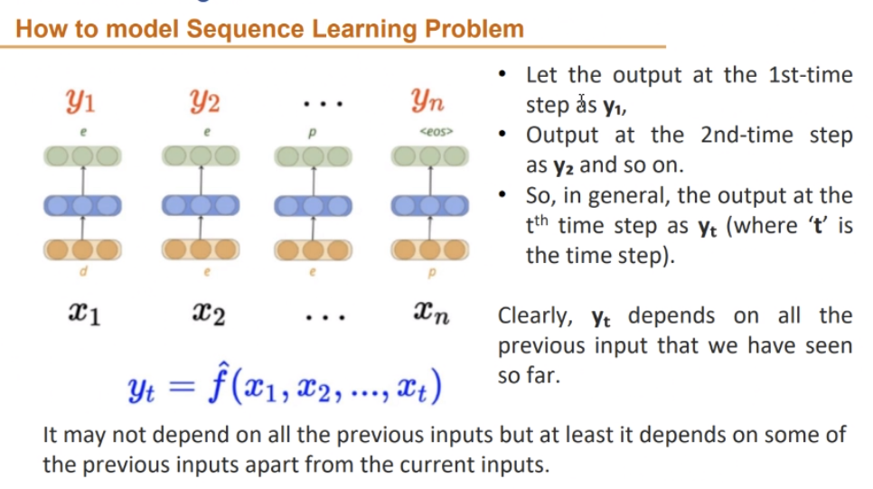

### CNN

<u>Faeture Mapping</u>
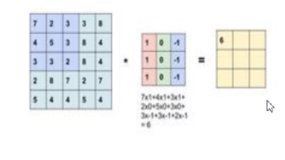

##### Convoltion filter

$$ Output\ Image\ size\ =\ \dfrac{n-f+2p}{s}+1$$
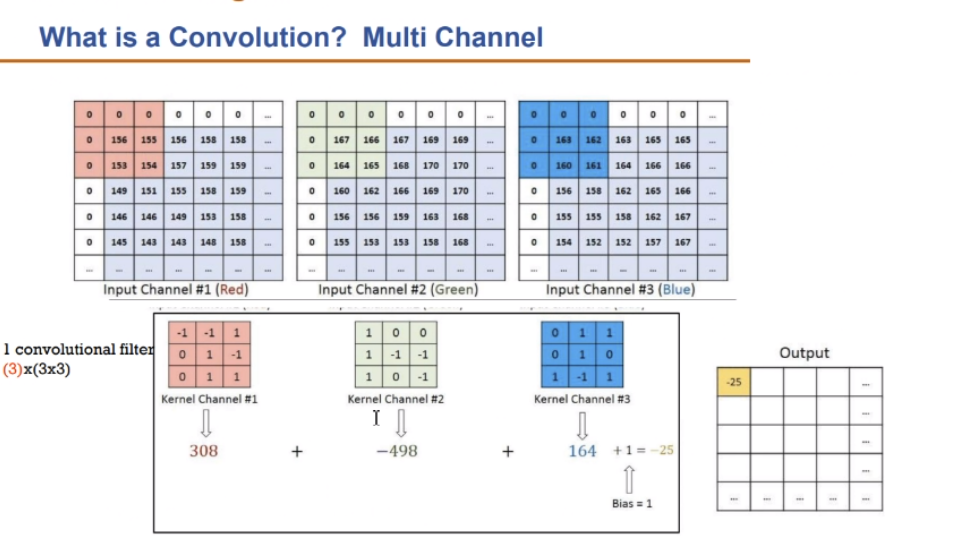

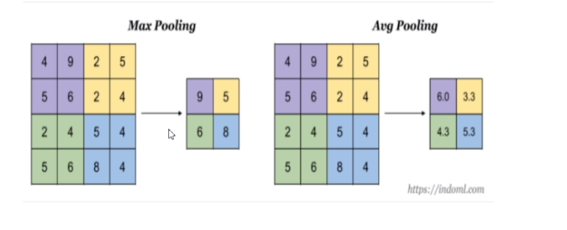

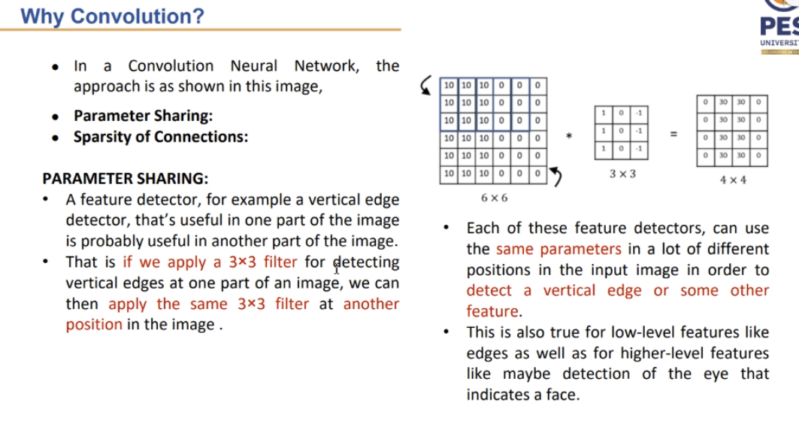
	$$no.\ of\ parametrs=k^2*c*n$$

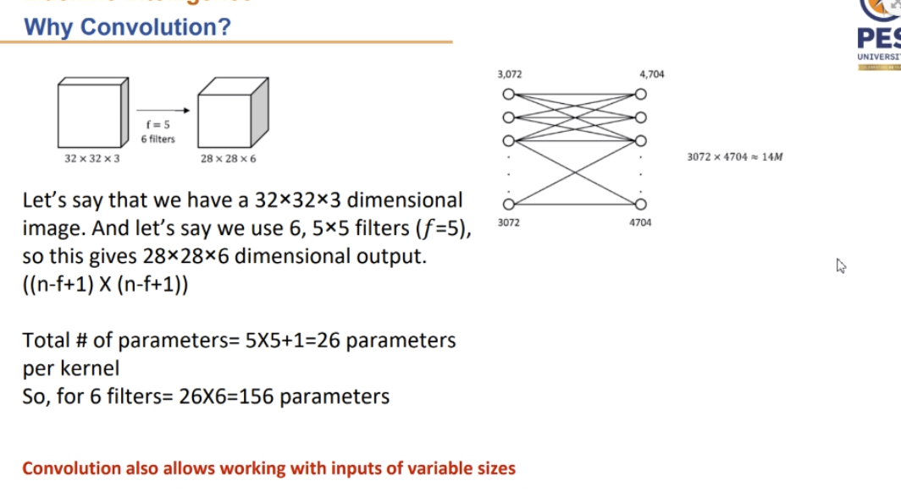

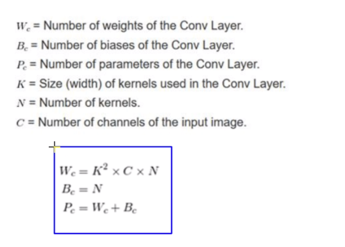

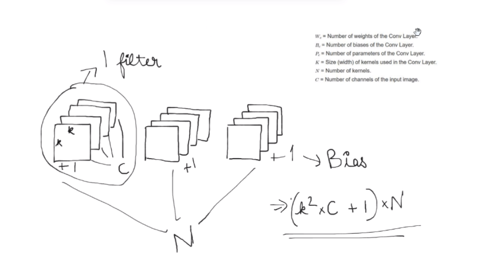

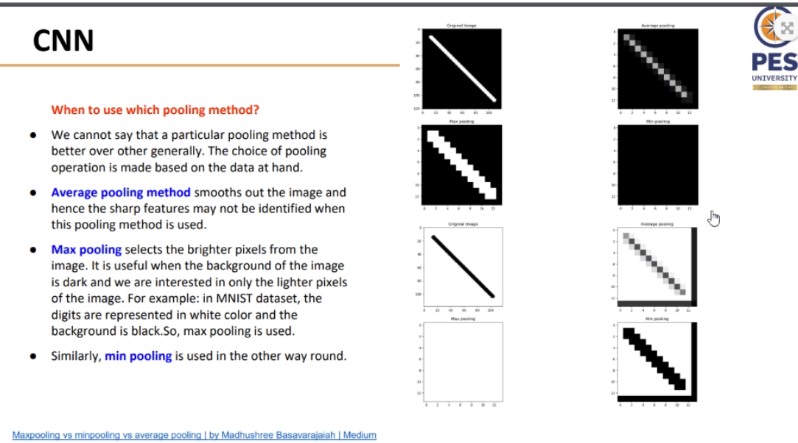
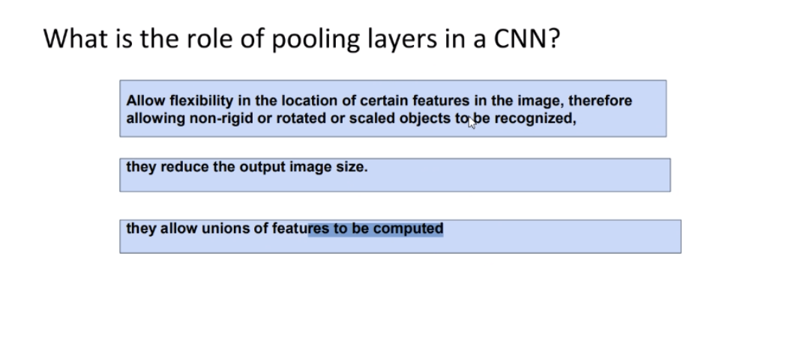
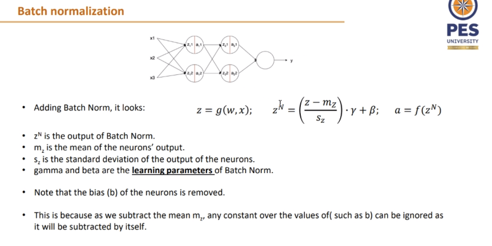