## CNN

Ann with convolution layers,pooling layers and fully connected(ann) layers.

### Why CNN?
- You can use ANN,but high computation cost.
- Overfitting cause you are capturing every single pattern
- Lose spacial information/arrangement info
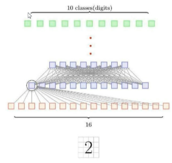
why should the last part of the number 2 go to the first neuron? ANN problem

Cnn tries to extract simple edges first.
Convolution layers extract features
Filter moves generating features for conv layer

### Convolution

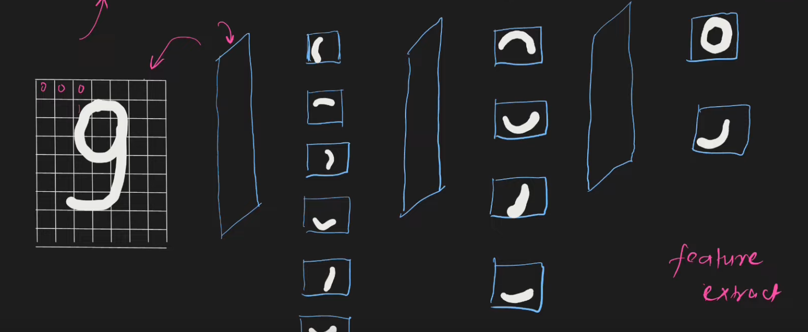
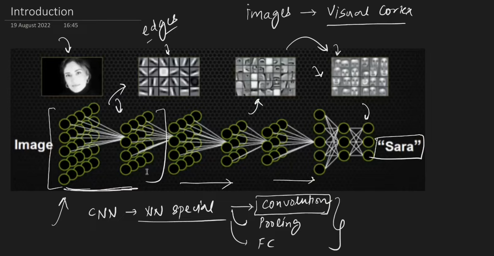
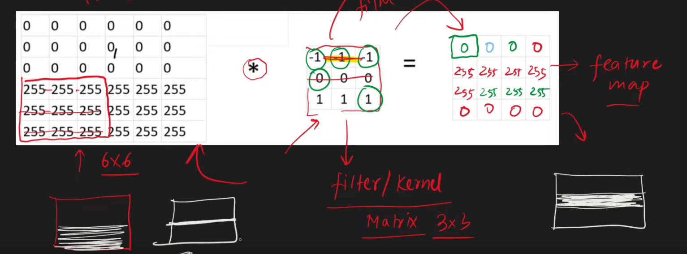
different filters to detect different edges
on this filter, lower 1's have weightage

Filter has NxN weights and one bias

In 3d one filter will give 2d, many will give those many output layers.

#### Padding
- We pad because the pixels on the corner for example shows up only once, but someother pixels show up more.
- We can pad to increase the occurances of those pixels.

#### Stride
- skip multiple inclusions of same pixel
- high level features you want
- computing easier

$$output=\lfloor{\frac{n-f}{s}\rfloor}+1$$

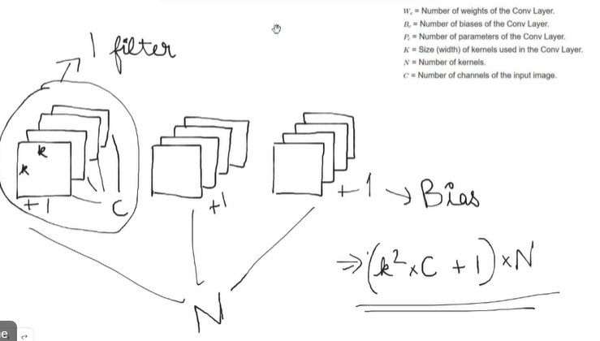
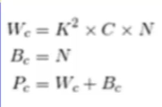

#### Problems with convolution
- memory
- 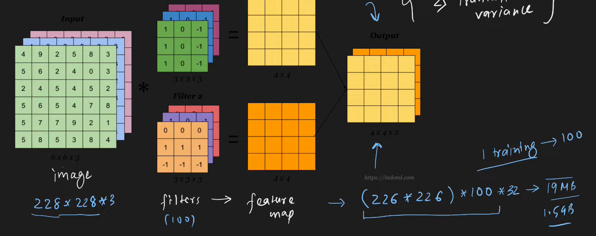
	1.5 GB

- translational invariance
	depends on where the feature is as filter if affected by pixel location

### Pooling
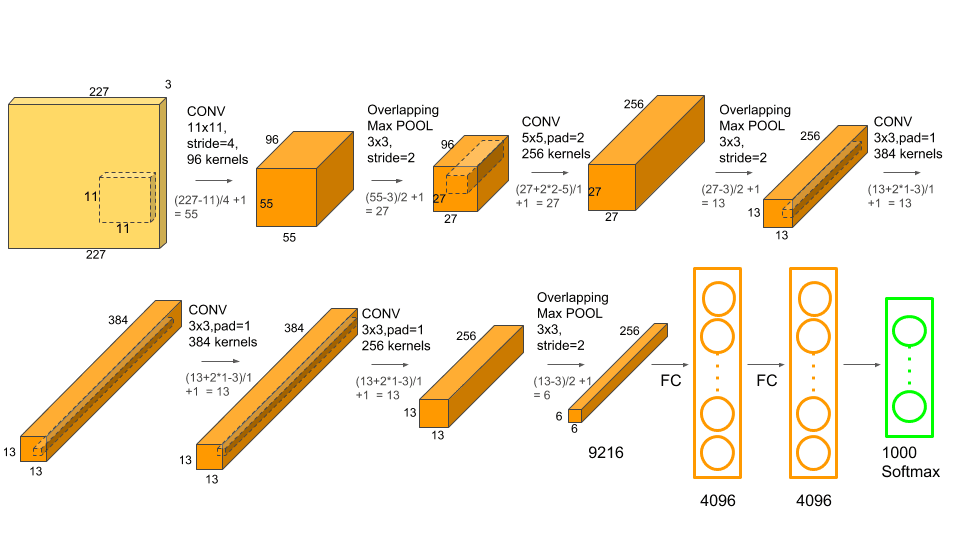
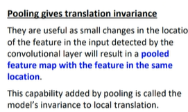
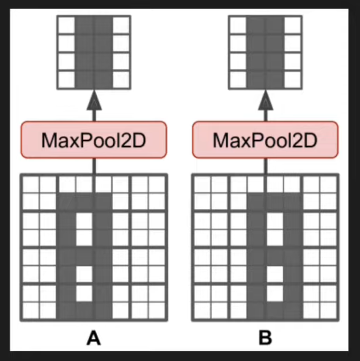
- max polling can enhance features
- Imagine different 9's ,if some feature of that 9 is in a slightly different pixel location, it will still get pooled in the same place.
- Control's overfitting 
- Eliminate low level details
- Always has a 2D kernel

### Normalization
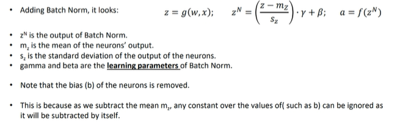
	
### Dropouts
Cnn is like ann with dropouts
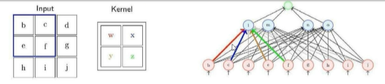
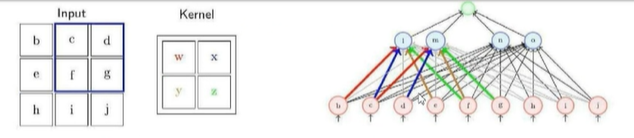
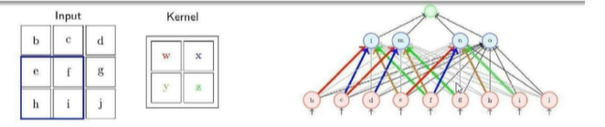