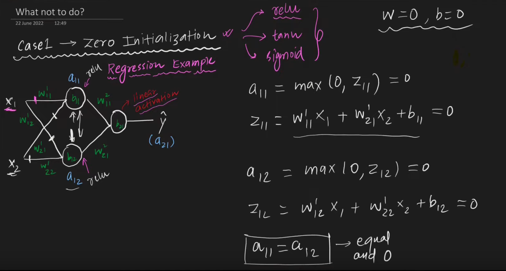
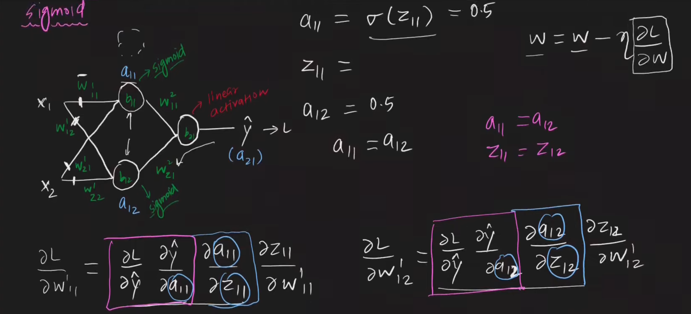
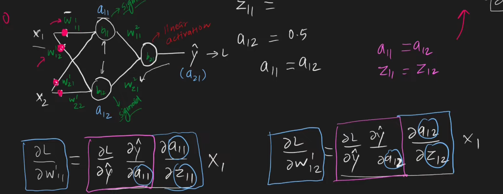
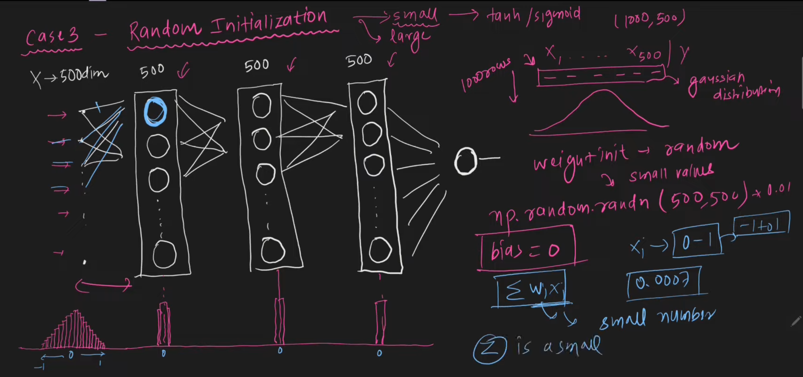
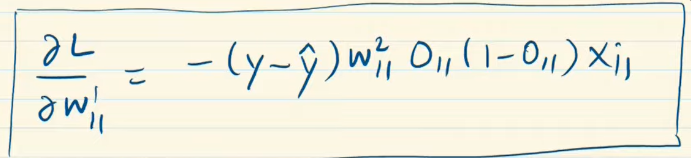
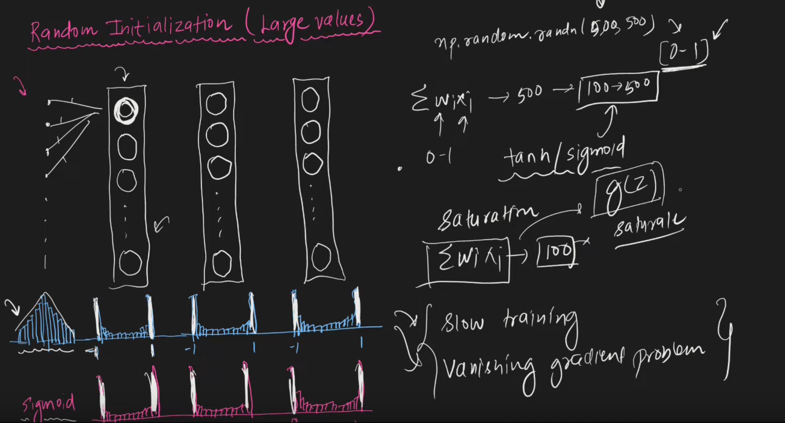

### Batch Gradient Descent

- Run all points at once, (dot prod of matrices) get predictions , we know actual, calc cost for each and sum it up
- So every epoch, w, b updates once.
- batch is faster running
- smooth curve, as it is averaging->asking every point
 
 - cant vectorize large batches of data, would not fit in memory

### Stochastic

- Shuffle data
- calc prediction->loss->update w, b
- stochastic converges faster though
- due to jaggedness, it can avoid local minima and find global
- even though it converges faster, it may not be exact

### Mini Batch
- Mix of both, set a batch size and do

*fun fact: batch sizes are generally in multiples of 2 due to memory optimizations.*

### Problems
- local minima
- saddle point(flat for long slow training)
- High curvature(Large Bulge harder to traverse)

### SGD With Momentum
- avoids high curvature
- flat areas
- local minimas

- $\beta$  is decaying factor if its .9 then current is .9 of prev which is .9 of its prev
-  prev influence=$\frac{1}{1-\beta}$
-  $\beta=1$ is like no friction pendulum

It's faster,but its unstable before settling down,oscillates around miniman

### Nesterov Accelerated gradient

- Smaller bounces around minima
- but lesser momentum than sgd with momentum
### AdaGrad
`Adaptive gradient`

- if you haven't normalized, scale is different use AdaGrad
- sparse input(for different w, low loss as it is sparse,so it will elongate,so its flat along one axis and you aren't moving there)
- 
![[../../Attachments/gradient_des20230929.excalidraw.svg]]
%%[[../../Attachments/gradient_des20230929.excalidraw.md|🖋 Edit in Excalidraw]], and the [[../../Attachments/gradient_des20230929.excalidraw.dark.svg|dark exported image]]%%

*Solution*

- Different learning rates
- If sum of previous gradients are large->reduce learning rate
- If small->increase

*Problems*
- as you approach minima,sum of previous gradients are large,so learning rate much lesser cannot converge at minima,expecially for the non sparse weight,as sum of previous gradients is large
- use in regression not neural nets

### RMSprop
`root mean square prop`
fixes the problems adagrad had

Weightage to recent epochs

**It is a very powerful technique**

### Adam

 
### Vanishing Gradient and Exploding Gradient 
- deep layers, many times come across activation function derivatives that have (0,1] range, so it'll keep getting smaller . Even normalised or standardized input will get it smaller
- sigmoid, tanh
- can use relu but dying gradient problem for 0 or neg activations
- there is exploding gradient problem which is the opposite to this (in RNN)
- **Proper weight initialization** (in 2000 research stopped because of this)
	- Vanishing
	- Exploding
	- Slow convergence
	
	- `as in the derivating of loss step, with chain rule we will calculate for activation, we get 0 so no training`
	- same for tanh
	
	
	- so w11 and w12 are always the same, same for the others.Hidden layer collapses,like perceptron.
	
	- same case
	
	-  if you use tanh, the outputs again of tanh when close to 0 will output 0
	- for sigmoid wont be as much
	- relu still better tan sigmoid
	- weights wont update
	- if activation is small(if z is small) then 
	
		- relu in this case will explode
	
	

