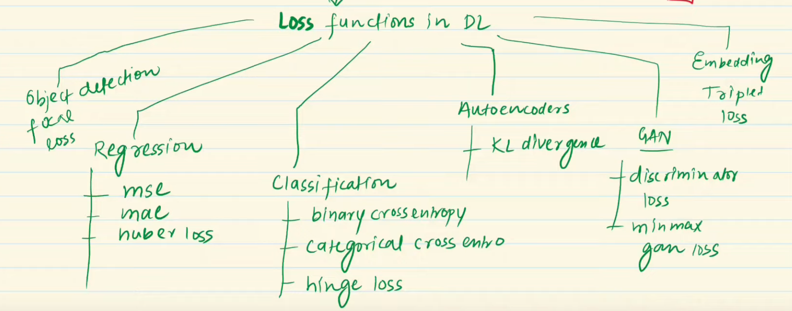
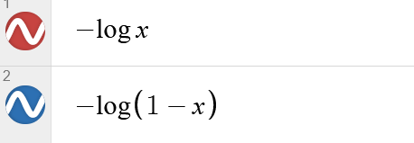

### Why loss functions

> *You can't improve what you cant measure
> <cite>-Peter Drucker</cite>

We call it **loss/error function** with a **single** training example.
**Cost function** generally when we're talking about the **batch.**
$$cost\;function=\frac{1}{n}\sum loss\;function$$

### MSE
Squaring is good as it shows how much to change the parameters 
$more\;loss == greater\;change$

|Advantages|Disadvantages|
|------------|---------------|
|Easy to interpret|Error Unit squared E.g. $lpa^2$|
|Differentiable|Outliers Affect a lot|
| 1 local minima||

MSE used with linear activation

### MAE

|Advantages|Disadvantages|
|------------|---------------|
|Easy to interpret|Not differentiable at origin|
|Error Unit same||
|Outliers not square affected||

Can't do normal gradient descent, need to work with subgradients

### Binary Cross Entropy

$log\;loss=-y\log{(\hat{y})}-(1-y)\log{(1-\hat{y})}$

### Categorical Cross Entropy

$$L=-\sum_{j=1}^{k}y_j\log(\hat{y})$$
SoftMax activation used

### Sparse Categorical Cross Entropy

Multiclass outputs can be not one hot, so useful for many categories(classes)

while calculating loss just take the log term that corresponds with output

