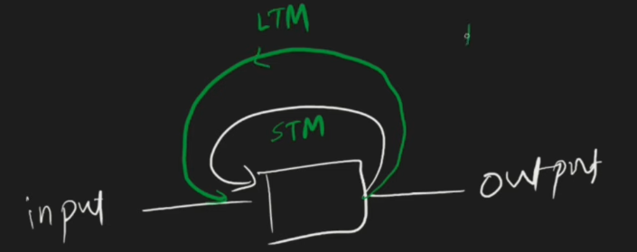
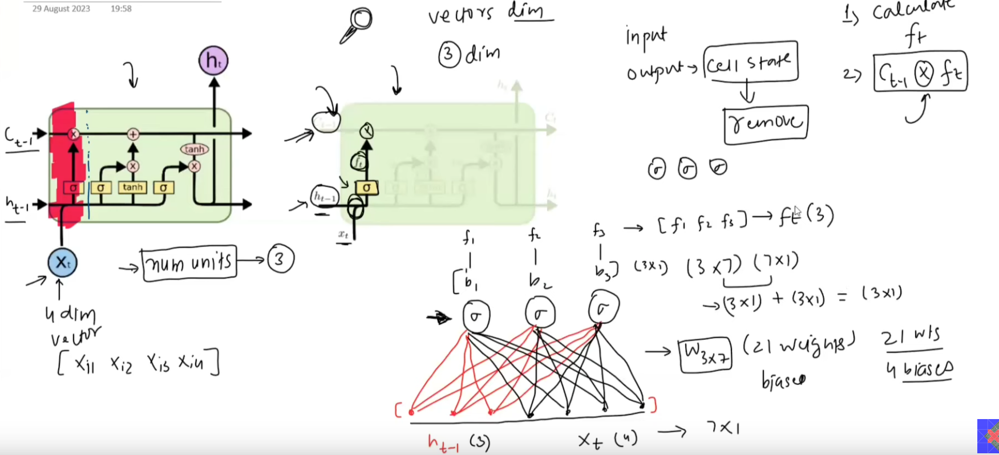
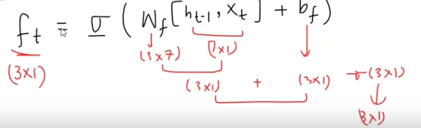
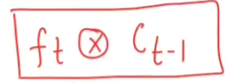
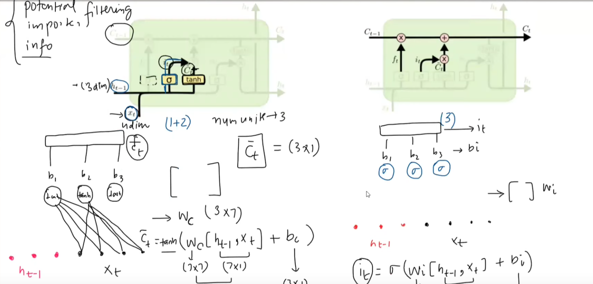
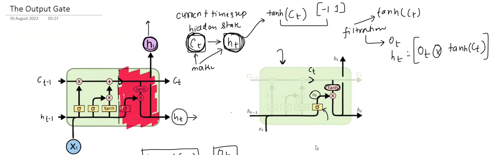

`LSTM: Long Short Term Memory`
### Why LSTM
RNN had problems!!

### How to store long term

Seperate path for long term context.
Stays in Long Term memory that can be referred to by short term memory
Decide when to update and overwrite Long Term memory

### Differences between LSTM & RNN
- 2 states
- Complex architecture to communicate between the states
![[../../Attachments/lstm20230929.excalidraw.svg]]
%%[[../../Attachments/lstm20230929.excalidraw.md|🖋 Edit in Excalidraw]], and the [[../../Attachments/lstm20230929.excalidraw.dark.svg|dark exported image]]%%

`No of units same for all yellow boxes->hyper param`

-  **1**
	
	
	
	$f_t$ is forget gate
	$C_{t-1}$ = $f_t$ $\times$ $C_{t-1}$

-  **2**
	
	
	$C_t=C_{t-1}+(i_t\:\times\:\bar{C}_t)$

	Advantage here is in long term, lets say you did not forget anything and you did not input also, $C_{t-1}$ would continue

-  **3**
	
	
	*STM* output *depends* on *LTM*
