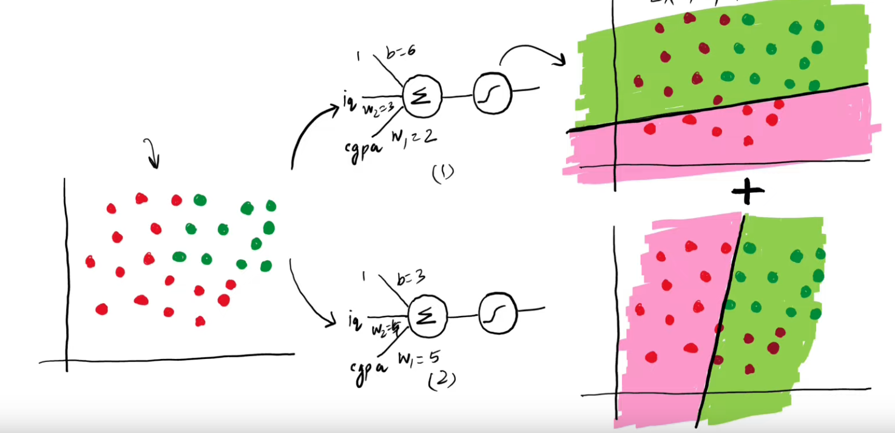
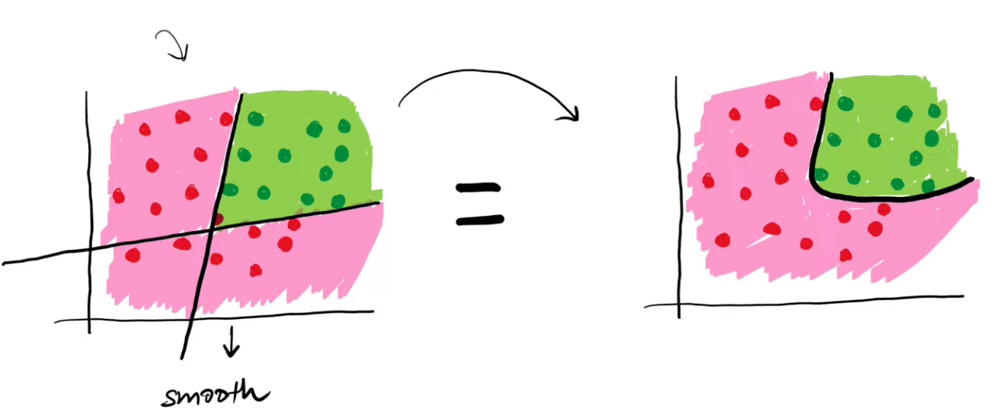
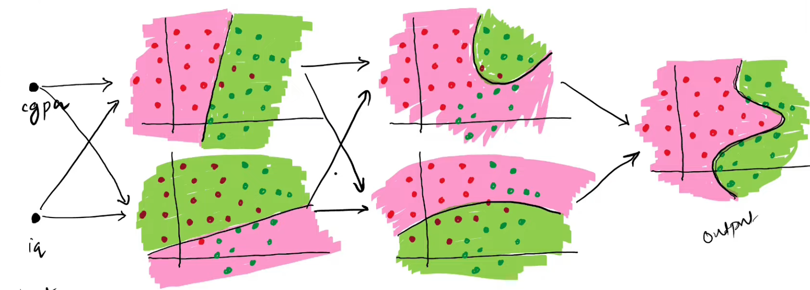

### MLP notation

- Bias $b_{ij}$ where $i->layer, j->node$
- Output $o_{ij}$ where $i->layer, j->node$
- Weight $w^l_{ij}$ where $l->layer,i->from,j->to$

### Why MLP

- from both graphs, pick same student (weighted) add the probabilities, might be greater than 1, so run through sigmoid to get between 0/1
- you can selects the weights of the outputs of each perceptron to decide influence of each and also add a bias(basically another perceptron)

There can be many output nodes, like in multiclass classification

[index](MI/Unit_2/index.md)
