### Handling overfitting with regularization

#### Bias and Variance
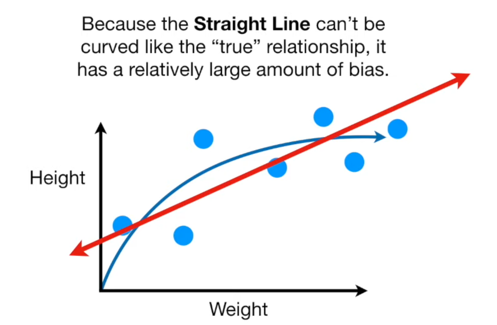
- Line has high bias
- A squiggly line will fit the true blue curve.
- Calculating error(bias) too, we get nothing for the squiggly line but something for the regression
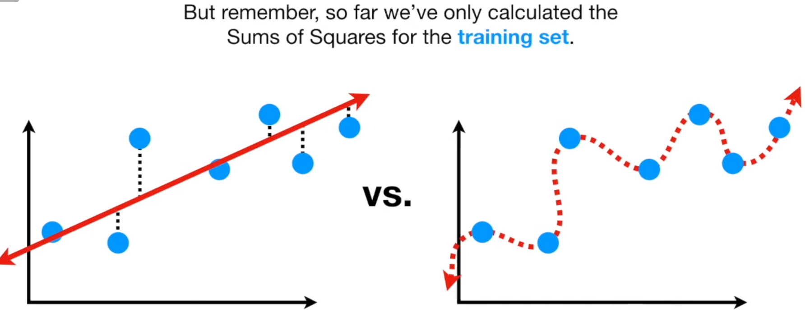
- $Now\; bring \;in \;testing\;set$
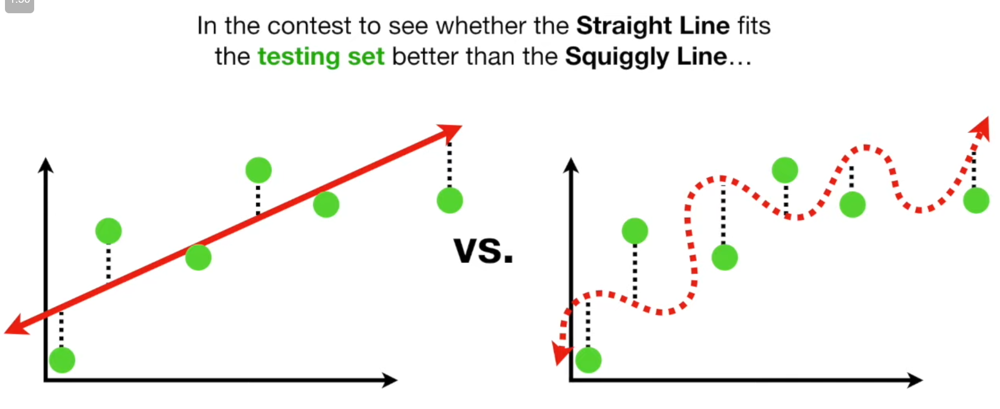

|   Type  | Bias | Variance |
| --- | ---- | -------- |
|   Line  | High | Low      |
|   Squiggle  | Low  | High     |

For training data(One dataset)->Squiggly line has low, as it fits the curve
Variance(Diff datasets)->Squiggly line has vastly different sums of squares for different data

**Ideal** model has low ***bias*** and low ***variance***
So find a sweet spot between simple and complex

$$C=\frac{1}{n}\sum_{i=1}^nLoss\;+\;Penalty$$
#### Regularization

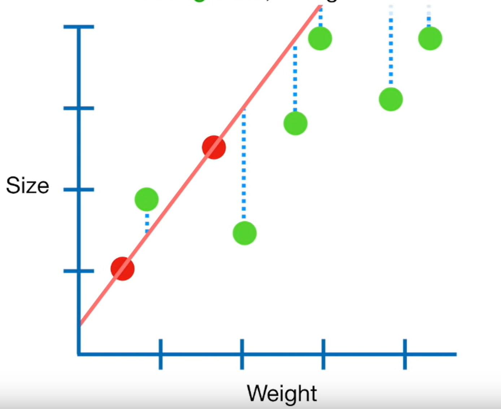
`green:test`  `red:train`
variance is high, it is overfit ,so we find new red line that is slightly bent(introducing bias)
trade low->higher bias for high->lower variance

Generally you minimize L 
ridge you minimize $L+(\lambda\; \times\; W^2)$
lasso you minimize $L+(\lambda\; \times\; |W|)$
Lasso shrinks the less important feature’s coefficient to zero thus, removing some feature altogether. So, this works well for== in case we have a huge number of features.

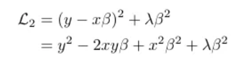
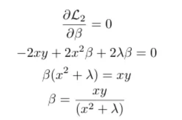

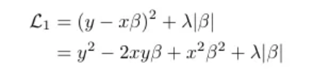
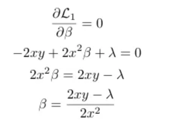
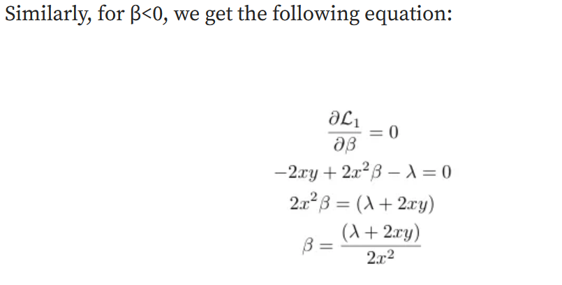
From both of the above equations, we see that in the case of L1 regularization, there are infinite possible values of x and y for a given _λ,_ for which it is possible for β to be 0. Hence in contrast to Ridge regression, LASSO or L1 Regression encourages 0 coefficients therefore acting as a method of variable selection.

$\lambda$ ranges from 0 to infinity

![[../../Attachments/regularization 2023-09-25 16.34.48.excalidraw]]

- #### Dropout layers
 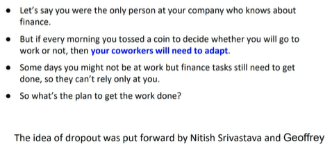
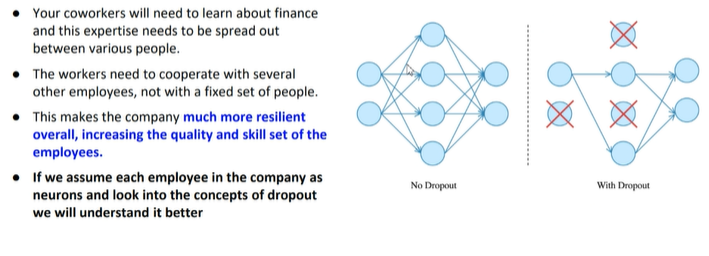
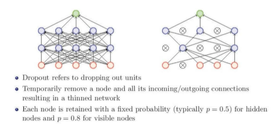
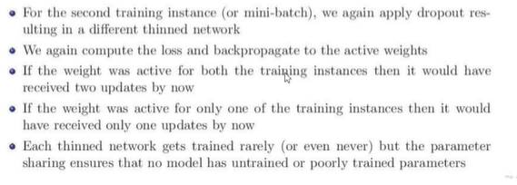
- weak weights not contributing to the loss
- active weights get trained
- promotes self development
- used in CNN

- #### Early Stopping
- #### Data Augmentation
