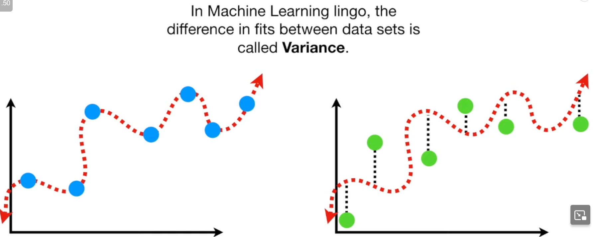

### Handling overfitting with regularization

#### Bias and Variance

- Line has high bias
- A squiggly line will fit the true blue curve.
- Calculating error(bias) too, we get nothing for the squiggly line but something for the regression

- $Now\; bring \;in \;testing\;set$

|   Type  | Bias | Variance |
| --- | ---- | -------- |
|   Line  | High | Low      |
|   Squiggle  | Low  | High     |

For training data(One dataset)->Squiggly line has low, as it fits the curve
Variance(Diff datasets)->Squiggly line has vastly different sums of squares for different data

**Ideal** model has low ***bias*** and low ***variance***
So find a sweet spot between simple and complex

$$C=\frac{1}{n}\sum_{i=1}^nLoss\;+\;Penalty$$
#### Ridge Regularization

`green:test`  `red:train`
variance is high, it is overfit ,so we find new red line that is slightly bent(introducing bias)
trade low->higher bias for high->lower variance

Generally you minimize L here you minimize L+($\lambda$ x $w^2$)

