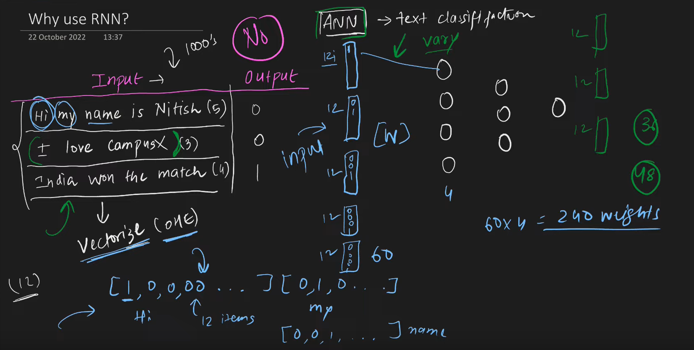
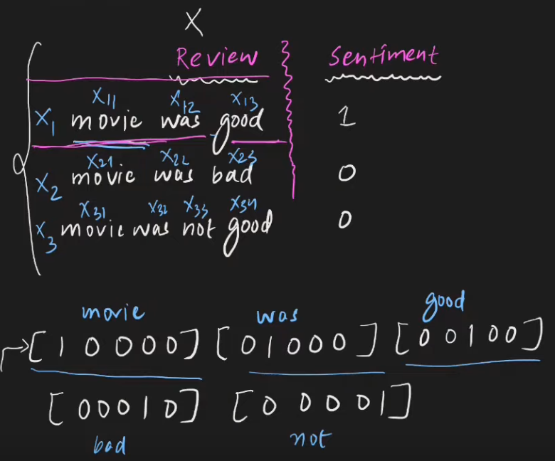
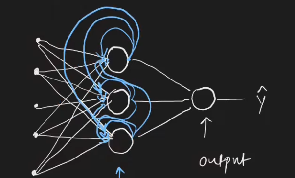
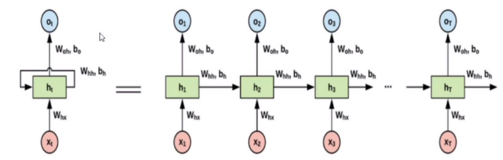
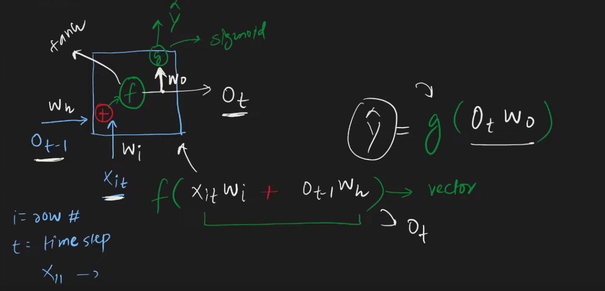
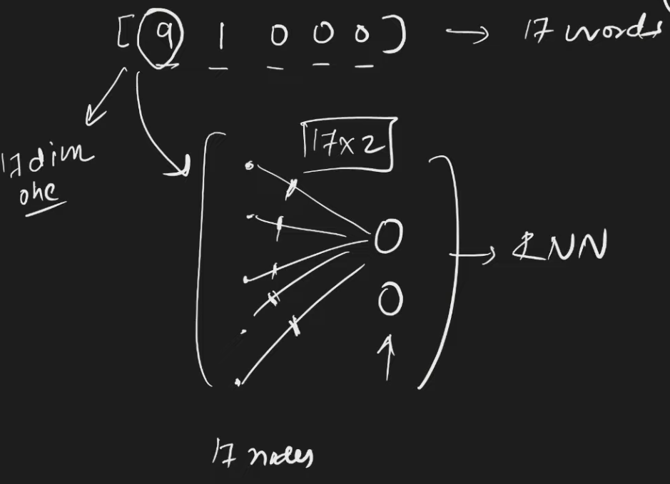
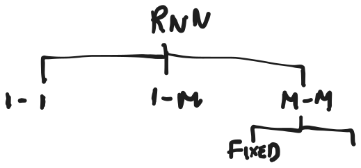

## Recurrent Neural Network

**Used for sequential data**
1) text
2) speech
3) timeseries
4) dna

### Why Rnn

You could supply $x_1$ then $x_1,x_2$ and so on but that takes a lot of time
- `Cant handle different input size` :Out of the 12 words, make each one 1 hot encoded and pass as input to Ann first sentence will need 60 inputs, but second will need only 36.
- You lose sequential info too(no memory)

- Can I zero pad the smaller sentences?
	- For large vocabulary and small sentences->lots of zero padding, unecessary computation
	- lets say in testing you have a larger sentence, even that wont work with padding
- Ann's not appropriate for this!

### Forward Propagation In RNN

Inputs in form of (timestep,input_features(one hot encoding of vocabulary data is an option))

feed input one by one

for every timestamp,feed output into next timestap input, for first time feed 0|random 

Keep looping until finaly timestamp, that will lead to output

![[../../Attachments/rnn2023-09-27,19.07.34.excalidraw.svg]]
%%[[../../Attachments/rnn2023-09-27,19.07.34.excalidraw.md|🖋 Edit in Excalidraw]], and the [[../../Attachments/rnn2023-09-27,19.07.34.excalidraw.dark.svg|dark exported image]]%%

### Embedding

- Improves semantic meaning
- helps fight sparsity

%%[[../../Attachments/rnn2023-09-27,21.12.29.excalidraw.md|🖋 Edit in Excalidraw]], and the [[../../Attachments/rnn2023-09-27,21.12.29.excalidraw.dark.svg|dark exported image]]%%
