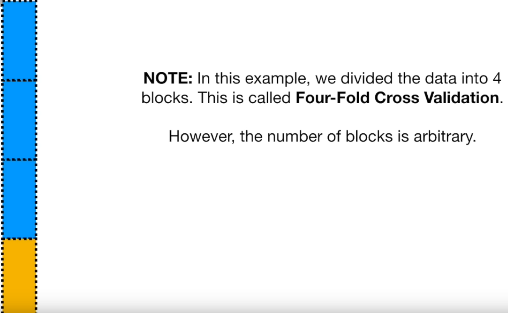
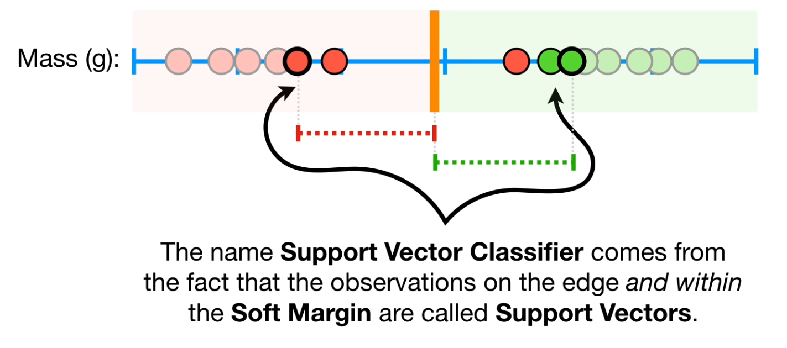
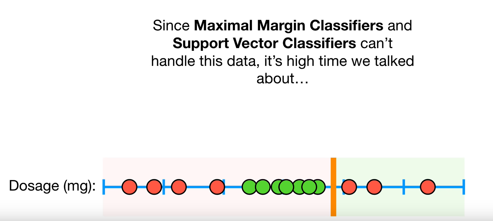
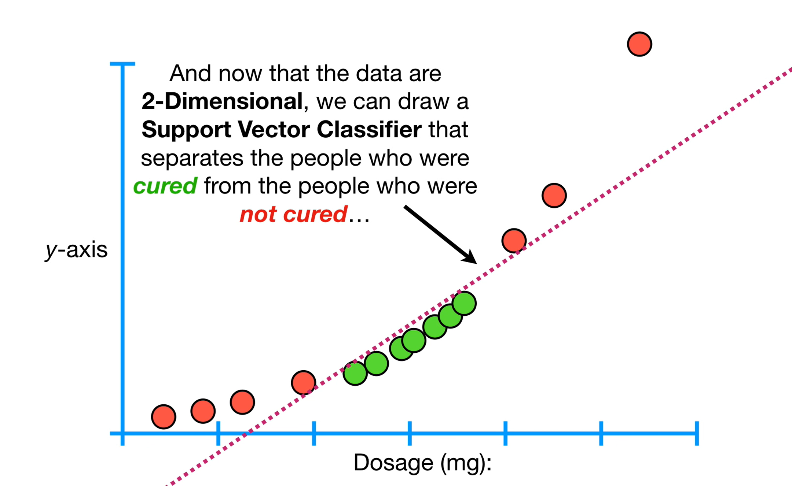
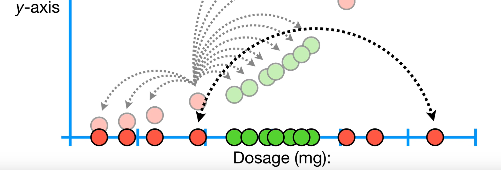

### SVC

When we allow misclassifications the distance between threshhold and observations is called a *soft margin*

Using a soft margin to decide threshhold->*soft margin classifier(support vector classifier)*

We use *Cross Validation* to determine that allowing this misclassification results in better
classification in the long run.
	- But how do we know that using the first 75% of the data for training and the last 25% of the data for testing is the best way to divide up the data?
	- Rather than worry too much about which block would be best for testing, cross validation uses them all, one at a time, and summarizes the results at the end.
	- In an extreme case, we could call each individual patient (or sample) a block. This is called "Leave One Out Cross Validation"
	- Can use this to get tuning parameters

### SVM

Square this dosage now
 
 
 - Move data do a higher dimension
 - But which function to use?
 - In order to make the mathematics possible, Support Vector Machines use something called Kernel Functions to systematically find Support Vector Classifiers in higher dimensions.
 - Polynomial Kernel with d=3 computes the 3-Dimensional relationships between each pair of observations 
 - Find a good value of d using cross validation
 - This trick, calculating the high- dimensional relationships without actually transforming the data to the higher dimension, is called The Kernel Trick.
 
  
  The Kernel Trick reduces the amount of computation required for Support Vector Machines by avoiding the math that transforms the data from Iow to high dimensions...

### Hard Margin
![[../../Attachments/SVM20231010_0.excalidraw.svg]]
%%[[../../Attachments/SVM20231010_0.excalidraw.md|🖋 Edit in Excalidraw]], and the [[../../Attachments/SVM20231010_0.excalidraw.dark.svg|dark exported image]]%%

### Soft Margin
![[../../Attachments/SVM20231010.excalidraw.svg]]
%%[[../../Attachments/SVM20231010.excalidraw.md|🖋 Edit in Excalidraw]], and the [[../../Attachments/SVM20231010.excalidraw.dark.svg|dark exported image]]%%