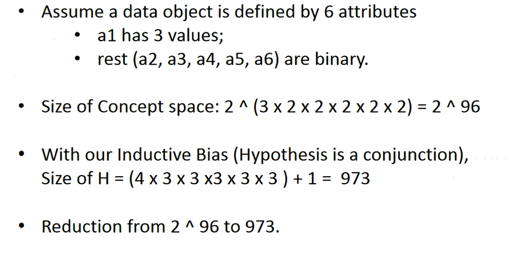
2 binary attributes->hypothesis spce is 2x2=4
size of concept space 2^4
with conjuntion is 4x4 but wait group nulls so 3x3 +1
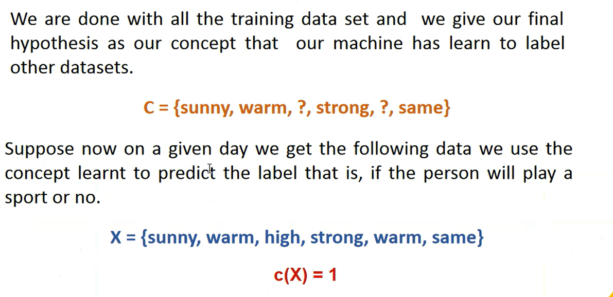
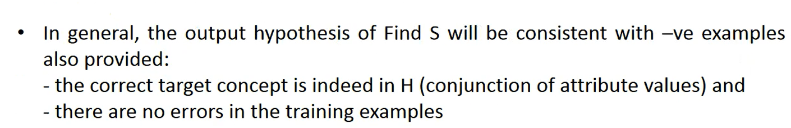
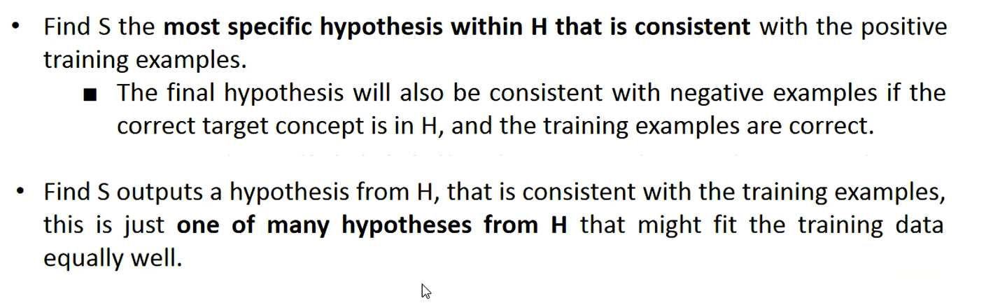
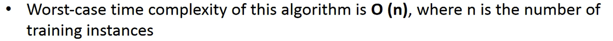
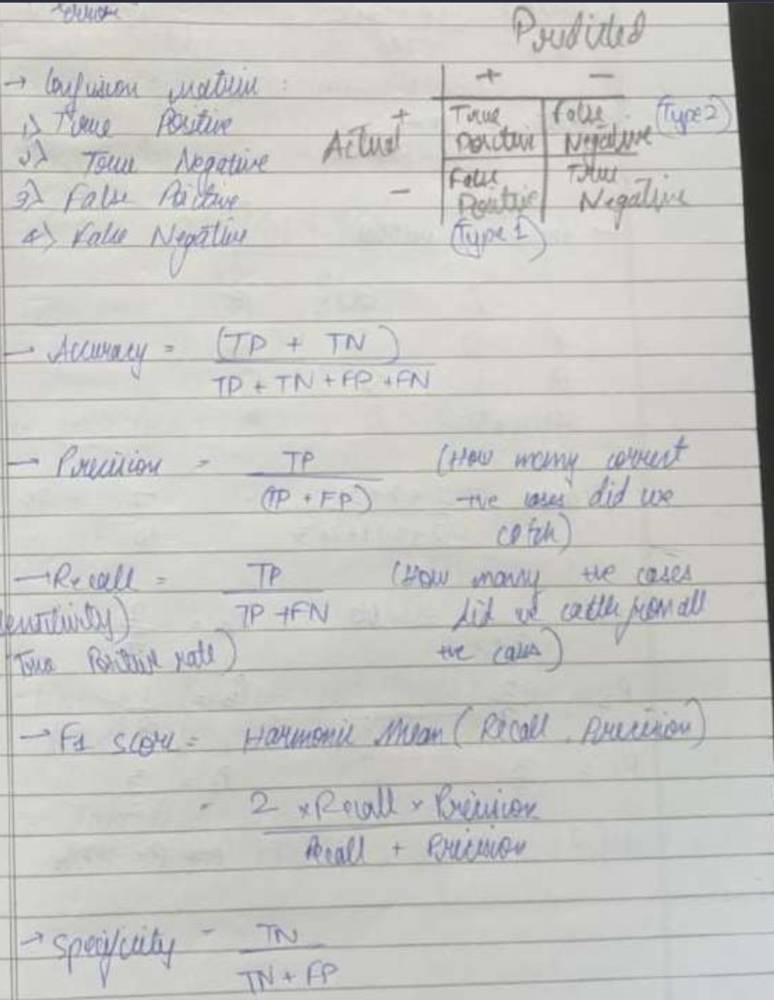

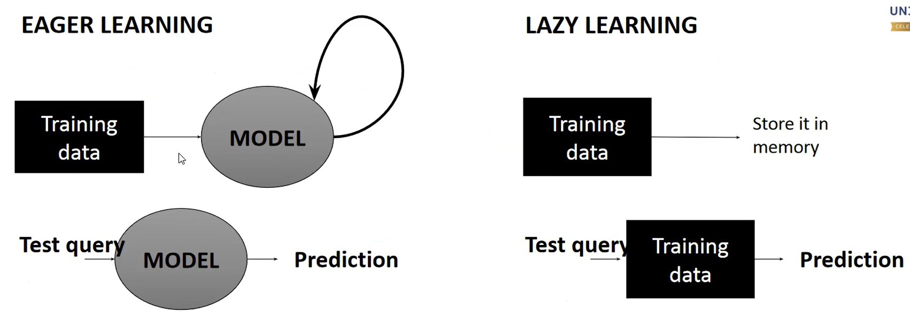
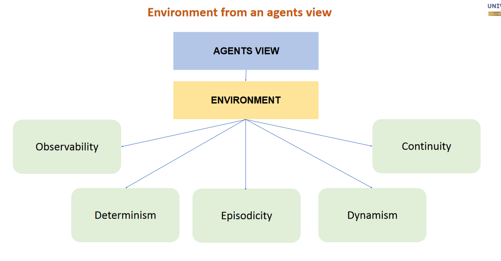
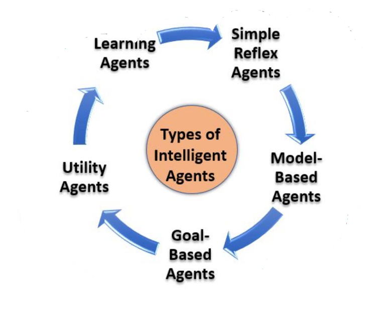
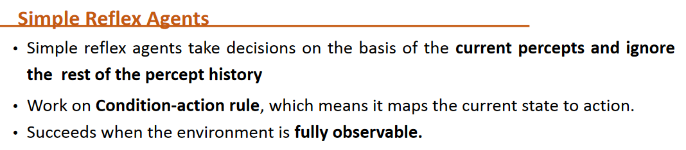
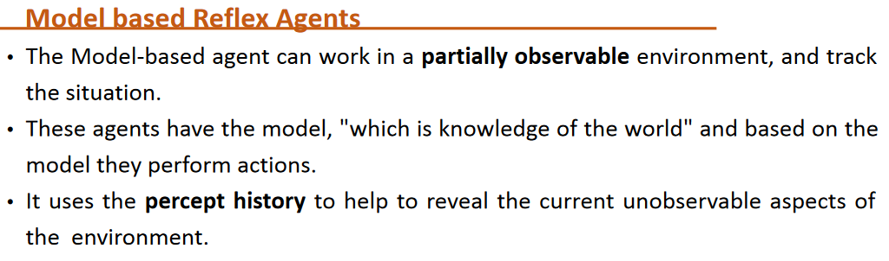
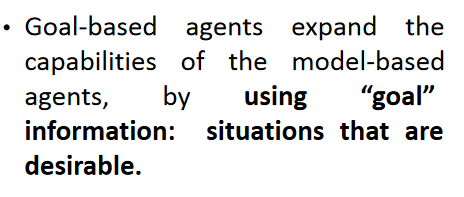
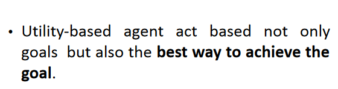
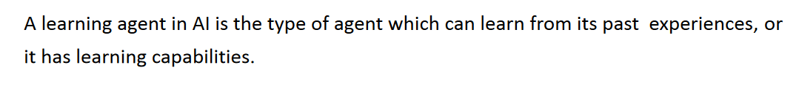

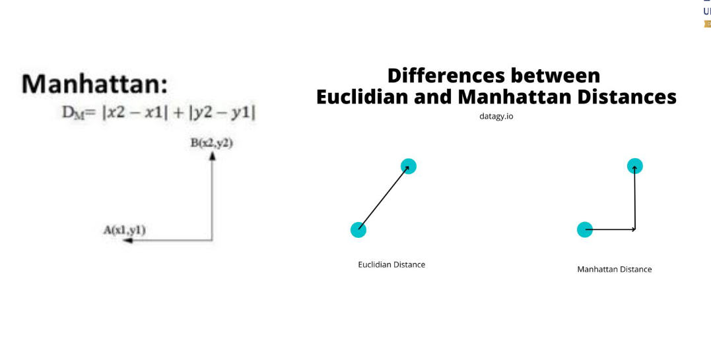
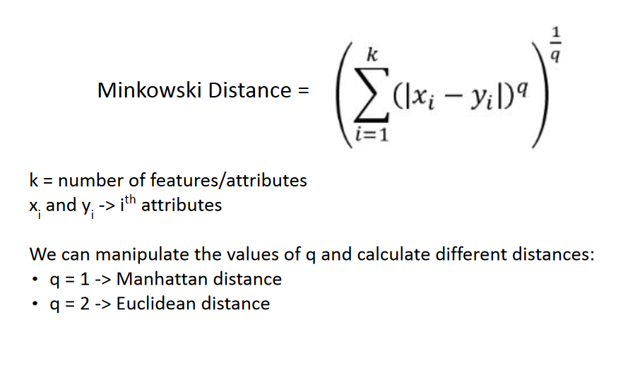
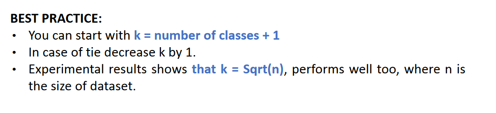
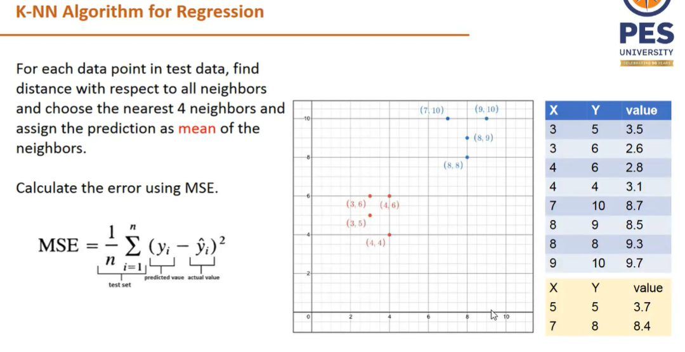
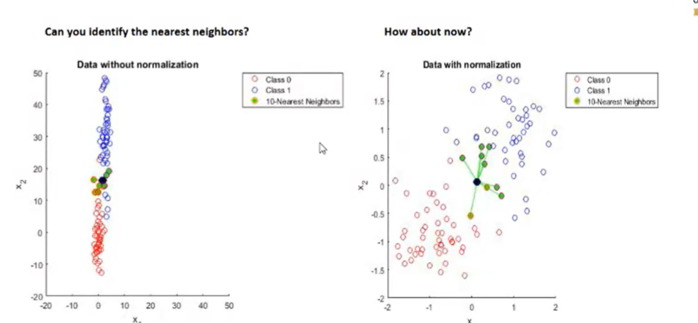
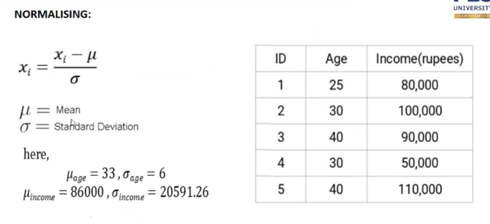
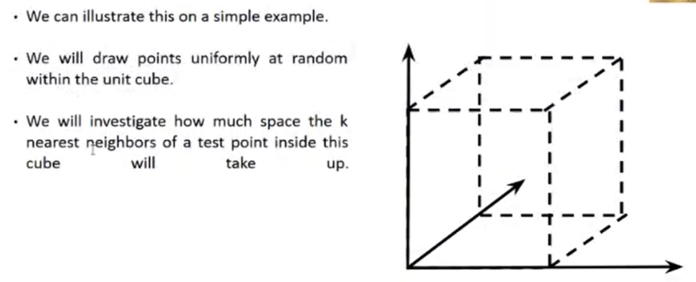
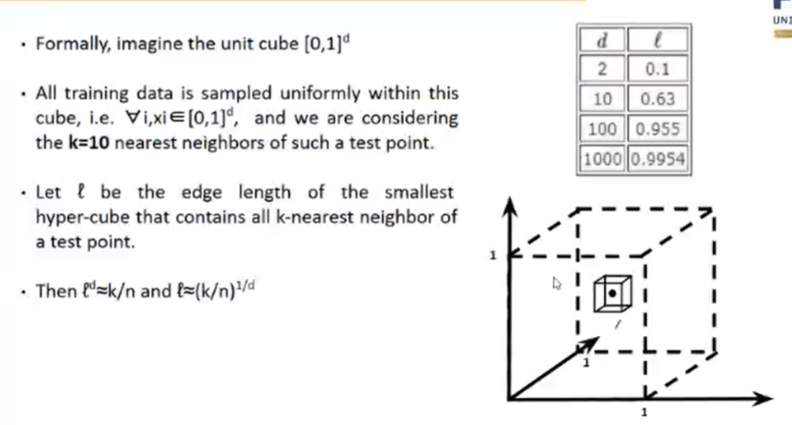
# **Overfitting in Decision Trees**

In decision trees, In order to fit the data (even noisy data), the model keeps generating new nodes and ultimately the tree becomes too complex to interpret. The decision tree predicts well for the training data but can be inaccurate for new data. If a decision tree model is allowed to train to its full potential, it can overfit the training data.
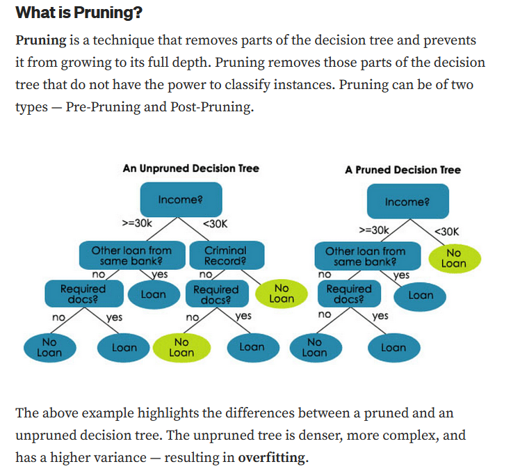
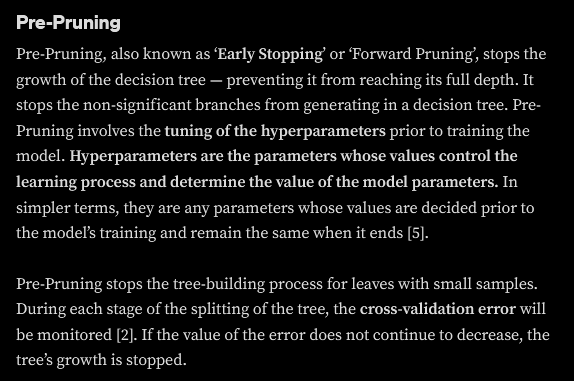
## **Hyperparameter Tuning for Pre-Pruning Decision Trees**

The hyperparameters that can be tuned for pre-pruning or early stopping are **max_depth, min_samples_leaf, and min_samples_split.**

- **_max_depth_**: Specifies the **maximum depth of the tree**. If None, then nodes are expanded until all leaves are pure or until all leaves contain less than min_samples_split samples.

The more the value of **_max_depth_**, the more complex the tree will be. On increasing the **_max_depth_** value, the training error will decrease but it can result in inaccurate predictions on the test data (overfitting). Hence, the correct _max_depth_ value is the one that results in the **best-fit decision tree** — neither underfits nor overfits the data.

- **_min_samples_leaf_**: Specifies the minimum number of samples required at a leaf node.

Let’s consider a scenario where the **_min_samples_leaf_** of a model is set to 5, and our current node has 20 samples. The model has to decide where to continue splitting on this node or stop here. To consider this parameter, the model splits at this node and checks for the number of samples in the left and right branches. If both of them are larger than 5, then the model will split at this node. If even one of the branches has less than 5 samples, this split will not be done and this unsplit node will be a terminal node (leaf).

- **_min_samples_split_**: Specifies the minimum number of samples required to split an internal node.
# **Post-Pruning**

Post-Pruning or ‘backward pruning’ is a technique that **eliminates branches from a “completely grown” decision tree** model to reduce its complexity and variance. This technique allows the decision tree to grow to its full depth, then removes branches to prevent the model from overfitting. By doing so, the model might slightly increase the training error but drastically decrease the testing error [4].

In Post-Pruning, non-significant branches of the model are removed using the **Cost Complexity Pruning (CCP)** technique. This algorithm is parameterized by **α(≥0) or alpha** known as the complexity parameter. The **cost_complexity_pruning_path** function of the _sklearn_ package in Python calculates the effective alphas and their corresponding impurities at each step of the pruning process. In cost complexity pruning, the **_ccp_alpha or the alpha value_** **can be tuned to get the best-fit decision tree model**.